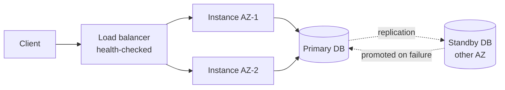

# Availability

Availability is the proportion of time the system is able to serve requests successfully. It is an **operational** characteristic, and usually the first one a business notices when it is missing.

### How it is measured

`availability = uptime / (uptime + downtime)`

Expressed as "nines", over a 30-day month:

| Target | Downtime per month | Typical setting |
| --- | --- | --- |
| 99% ("two nines") | ~7 h 18 min | Internal tools |
| 99.9% | ~43 min | Standard SaaS |
| 99.95% | ~22 min | Business-critical SaaS |
| 99.99% | ~4 min 20 s | Payments, telecom |
| 99.999% | ~26 s | Core infrastructure |

Two related metrics drive the number:

- **MTBF**: mean time between failures. Reduced by removing single points of failure.
- **MTTR**: mean time to recovery. Reduced by fast detection and automated failover. See [Recoverability](Recoverability.md).

Beyond three nines, improvements come almost entirely from cutting MTTR, not from preventing failures.

### Design tactics

- **Redundancy.** Run at least N+1 instances of every component, across failure domains (process, host, rack, availability zone, region).
- **Remove single points of failure.** A single primary database, a single load balancer, or one shared cache is the ceiling of your availability.
- **Health checks and automated failover.** Detection must be automatic; a human paged at 3am is a 20-minute MTTR at best.
- **Bulkheads.** Isolate resources per client or per workload so one heavy consumer cannot exhaust the pool for everyone.
- **Circuit breakers and timeouts.** Never let a slow dependency turn into a queue of blocked threads. Fail fast, then retry with backoff and jitter.
- **Graceful degradation.** Serve a stale cache or hide the recommendations widget rather than returning a 500 for the whole page.

### Availability is a chain

For components in series, availabilities multiply. Three services at 99.9% each, all required for a request, give:

`0.999 × 0.999 × 0.999 ≈ 0.997`, roughly 2 h 10 min of downtime per month.

This is why adding synchronous dependencies quietly lowers availability, and why asynchronous messaging (see [Event-Driven Architecture](../Architectural%20Patterns/EDA.md)) is an availability tactic: the caller stays up when the callee is down.

### Trade-offs

- Against **consistency**: staying available during a network partition means accepting divergent data (the CAP trade-off).
- Against **cost**: redundancy across regions can multiply infrastructure spend.
- Against **simplicity**: failover, quorum, and split-brain protection are hard to reason about and harder to test.

### Fitness functions

- Synthetic probes from multiple regions, alerting on error-rate SLO burn.
- Chaos experiments: terminate an instance, an AZ, or a dependency in staging and assert the SLO holds.
- CI check that no service is deployed with fewer than two replicas.

## Check Your Understanding

<quiz>
Three services, each 99.9% available, are all required to serve one request. What is the request's availability?

- [x] About 99.7%, because availabilities of components in series multiply
> Correct. 0.999³ ≈ 0.997, so every synchronous dependency added lowers the achievable availability.
- [ ] 99.9%, because the target is set by the weakest component
- [ ] 99.97%, because failures are independent and cancel out
- [ ] 100%, because the services are redundant copies
</quiz>

<quiz>
Past three nines, which lever improves availability the most?

- [x] Reducing MTTR through automated detection and failover
> Correct. Failures become inevitable at scale, so recovery time dominates the availability budget.
- [ ] Buying more reliable hardware to raise MTBF
- [ ] Adding more code review before releases
- [ ] Increasing the request timeout
</quiz>
