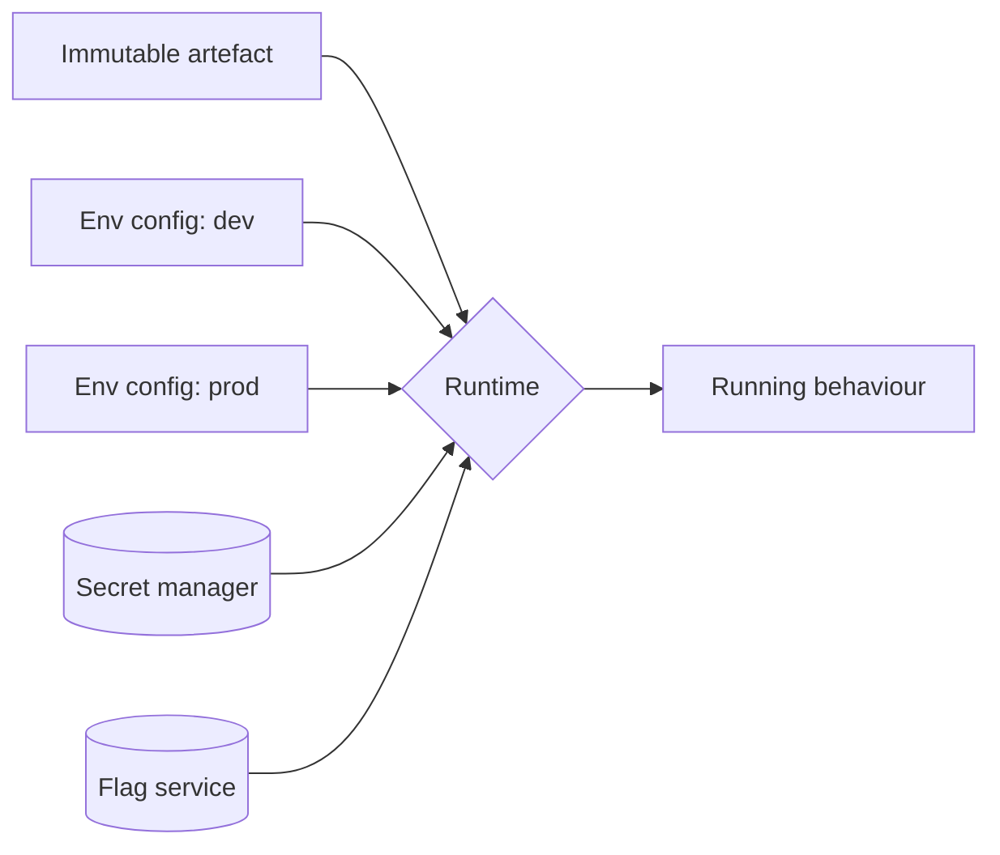

# Configurability

Configurability is the ability to change the system's behaviour without changing its code, through configuration files, environment variables, feature flags, or runtime settings. It is what allows one artefact to run in every environment, and one product to serve many customers.

### What belongs in configuration

| Belongs in configuration | Belongs in code |
| --- | --- |
| Values that differ per environment (URLs, pool sizes) | Business rules |
| Secrets and credentials (via a secret store) | Control flow that must be tested |
| Operational limits and timeouts | Anything with only one possible value |
| Feature flags with a planned removal date | Anything that has never changed |

The failing mode on both sides is real: hard-coded environment values block deployment, while a configuration system rich enough to encode business logic becomes an untested, undocumented programming language with no debugger.

### Design tactics

- **One artefact, many configurations.** The build output is identical everywhere; only injected configuration differs. See [Deployability](Deployability.md).
- **Externalise via environment or a config service**, not files baked into the image.
- **Validate at start-up and fail fast.** A missing or malformed setting must kill the process immediately with a clear message, not surface as a null three hours later.
- **Type and schema the configuration**, with defaults for everything safe to default and no defaults for anything security-relevant.
- **Never put secrets in configuration files or images.** Use a secret manager with rotation; see [Security](Security.md).
- **Give every feature flag an owner and an expiry.** Stale flags are permanent untested branches.
- **Log the effective configuration at start-up**, with secrets redacted; most "works on my machine" incidents end here.

### Trade-offs

- Against **testability**: every flag doubles the number of possible behaviours; ten independent flags give 1024 combinations, of which you test a handful.
- Against **understandability**: behaviour that lives in a config store is invisible to someone reading the code.
- Against **reliability**: dynamic configuration is a live change to production with no code review; treat changes as deployments, with versioning, audit, and rollback.

### Fitness functions

- Start-up schema validation as a test: run the app against each environment's configuration in CI.
- A scanner failing the build on secrets committed to the repository.
- Flag-age report alerting on flags past their removal date.
- A check that no environment-specific value appears in the built artefact.

## Check Your Understanding

<quiz>
Why should configuration be validated at start-up rather than when first read?

- [x] So a missing or malformed value fails the deployment immediately instead of causing an obscure failure later under load
> Correct. Fail fast at the boundary keeps bad configuration from reaching users.
- [ ] Because reading configuration later is slower
- [ ] Because environment variables expire
- [ ] Because validation is only possible before the process starts
</quiz>

<quiz>
What is the main cost of adding many independent feature flags?

- [x] Combinatorial explosion of behaviours, most of which are never tested together
> Correct. Each flag doubles the state space, so flags need owners and expiry dates.
- [ ] They slow down the build pipeline
- [ ] They cannot be changed without a redeploy
- [ ] They require a separate database per flag
</quiz>
