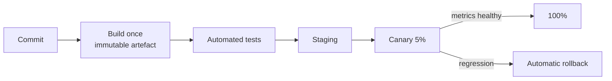

# Deployability

Deployability is how easily, quickly, and safely a change gets from a developer's machine into production. It sets the feedback loop for everything else: a system that can only be released monthly cannot learn monthly, and every release carries a month of accumulated risk.

### How it is measured

The four DORA metrics are the standard instrument:

| Metric | Meaning |
| --- | --- |
| Deployment frequency | How often changes reach production |
| Lead time for changes | Commit to running in production |
| Change failure rate | Share of deployments causing an incident |
| Time to restore service | How fast a bad deployment is undone |

The first two measure throughput, the last two stability. Contrary to intuition, they improve together: small frequent deployments carry less risk each.

### Design tactics

- **Small, independently deployable units.** The size of a deployment unit is the size of your risk. It is also why [Microservice Architecture](../Architectural%20Patterns/Microservice%20Architecture.md) exists. It is also why splitting badly, so that every change spans three services, destroys deployability instead of improving it.
- **One artefact, promoted through environments.** Build once; configure per environment. Rebuilding per environment means what you tested is not what you shipped.
- **Backward-compatible changes.** Expand/contract migrations: add the new column, write both, migrate readers, then drop the old one. Never deploy a schema change and the code that requires it in one irreversible step.
- **Decouple deploy from release** with feature flags, so shipping code and exposing behaviour are separate decisions.
- **Progressive delivery**: canary or blue-green, with automatic rollback on error-rate regression.
- **Fast, trustworthy pipeline.** A twenty-minute build that is flaky one run in five will be bypassed by humans, which is the real failure.

### Trade-offs

- Against **consistency of state**: rolling deployments mean two code versions run simultaneously, so message formats and schemas must tolerate both.
- Against **simplicity**: feature flags accumulate; unremoved flags become permanent hidden branches that hurt [Maintainability](Maintainability.md).
- Against **cost**: blue-green doubles the environment during a release.

### Fitness functions

- Pipeline duration budget failing the build when it regresses past a threshold.
- An automated schema-compatibility check rejecting non-backward-compatible migrations.
- A tracked rollback drill: measure how long a rollback actually takes, quarterly.
- Flag age report: alert on feature flags older than N days.

## Check Your Understanding

<quiz>
Why build one artefact and promote it, instead of rebuilding per environment?

- [x] So that what was tested is bit-for-bit what reaches production, with only configuration differing
> Correct. Rebuilding introduces differences that invalidate all earlier testing.
- [ ] Because rebuilding is always slower
- [ ] Because environments cannot share a container registry
- [ ] Because configuration must be compiled in
</quiz>

<quiz>
What does decoupling deployment from release with feature flags buy you?

- [x] Code can ship continuously while behaviour is exposed on a separate schedule, and can be turned off without a redeploy
> Correct. It shrinks deployment risk and makes rollback of behaviour instant.
- [ ] It removes the need for automated tests
- [ ] It guarantees backward-compatible database schemas
- [ ] It eliminates the need for staging environments
</quiz>
