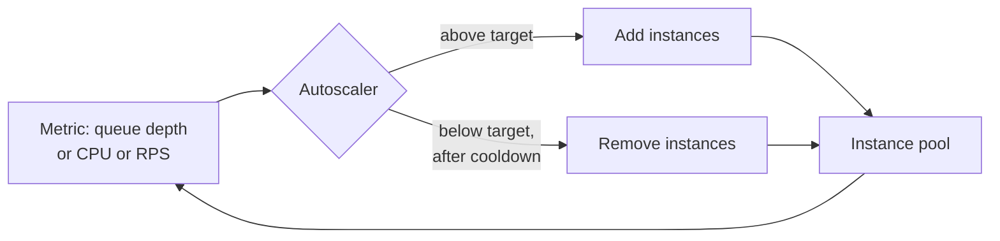

# Elasticity

Elasticity is the ability to absorb **sudden** changes in load by acquiring and releasing capacity automatically. It is often confused with [Scalability](Scalability.md), but they answer different questions:

| | Scalability | Elasticity |
| --- | --- | --- |
| Question | Can we handle 10× the users? | Can we handle a 10× spike in two minutes? |
| Time frame | Months of growth | Seconds to minutes |
| Trigger | Planning | Automation reacting to live metrics |
| Failure mode | Capacity ceiling | Slow reaction, thrashing, cost blowout |

Concert ticket sales, a product launch, and a news event all need elasticity. Steady user growth needs scalability. Most systems that need elasticity also need scalability, but not the reverse.

### What makes a system elastic

- **Fast start-up.** If an instance takes six minutes to become healthy, the spike is over before help arrives. Slim images, lazy warm-up, pre-baked artefacts, and pre-pulled containers all cut this.
- **Small units of scaling.** Fine-grained services scale the part under pressure. A monolith must replicate everything, including the 90% of code that is idle.
- **No state in the instance.** Instances must be disposable, scaling in kills them without warning.
- **Externalised connection limits.** Fifty new instances each opening a large database pool can take down the database that scaling was meant to protect. Use a proxy or bounded pools.

### Choosing the scaling signal

CPU is the default and often the wrong one. Prefer a metric that reflects the actual bottleneck:

- **Queue depth or consumer lag** for asynchronous workers, the most honest signal of unmet demand.
- **Requests in flight / concurrency** for I/O-bound services, which stay idle on CPU while saturated.
- **CPU** only for genuinely compute-bound work.

Add a **cooldown** so the autoscaler does not oscillate, and a **floor** so the system is never at one instance when a spike starts.

### Trade-offs

- Against **cost predictability**: elastic spend follows traffic, including traffic from bugs, retries, and bots. Set a maximum.
- Against **latency**: scaling reacts *after* the queue builds, so the first requests of a spike are slow. Pre-scaling on a schedule helps for known events.
- Against **downstream stability**: elastic front ends push load onto inelastic back ends. Scale the whole chain, or shed load.

### Fitness functions

- A spike test: 10× load in 60 seconds, asserting error rate stays under the SLO.
- A measured, alerting cold-start time budget per service.
- A cost guardrail: alert when scaled-out capacity exceeds the budgeted maximum.

## Check Your Understanding

<quiz>
What distinguishes elasticity from scalability?

- [x] Elasticity is about absorbing sudden bursts automatically; scalability is about supporting sustained growth in capacity
> Correct. They differ in time frame and mechanism, reactive automation versus planned capacity.
- [ ] Elasticity applies only to databases, scalability only to application servers
- [ ] They are synonyms with different vendor branding
- [ ] Elasticity means scaling up, scalability means scaling out
</quiz>

<quiz>
For a queue-based worker pool, which autoscaling signal is usually best?

- [x] Consumer lag or queue depth, because it directly measures unmet demand
> Correct. CPU can stay low while a backlog grows, so it reacts late or not at all.
- [ ] CPU utilisation, since it is the platform default
- [ ] Memory usage, since workers cache messages
- [ ] Instance count, to keep the number stable
</quiz>
