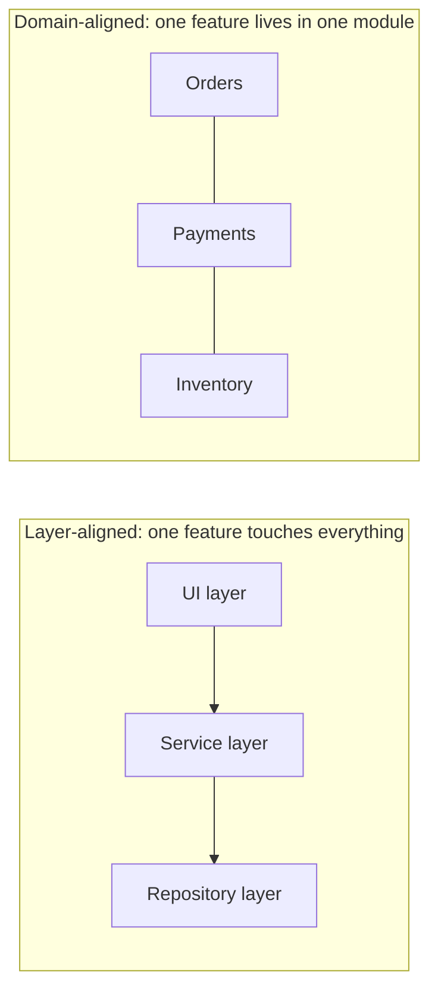

# Maintainability

Maintainability is how easily the system can be understood, changed, and extended. It is a **structural** characteristic: users never see it directly, but it sets the cost of every future feature and the speed of every bug fix. Over a long-lived system, it is usually the characteristic with the highest total financial impact.

### How it is measured

Maintainability resists a single number, so use a bundle of proxies:

| Signal | What it indicates |
| --- | --- |
| Lead time for a small change | The end-to-end friction of the codebase |
| Cyclomatic complexity per function | Local understandability |
| Coupling (afferent / efferent), dependency cycles | Structural entanglement |
| Number of files touched per typical change | Whether modules match how the system actually changes |
| Test coverage of changed lines | Confidence to change anything at all |
| Code age and churn hot spots | Where the pain is concentrated |

The most honest question: *how long does it take a new engineer to ship a small change safely?*

### Design tactics

- **High cohesion, low coupling.** Group what changes together; separate what changes for different reasons. This is the whole point of [SOLID Principles](../../Principles/SOLID%20Principles.md).
- **Align modules with the domain.** Modules named for business capabilities localise change; modules named for technical layers scatter every feature across all of them.
- **Depend on abstractions across boundaries**, so a replacement is a new implementation rather than a rewrite; see [Hexagonal Architecture](../Architectural%20Patterns/Hexagonal.md).
- **One obvious way to do each thing.** Three HTTP clients, two logging conventions, and four date formats each multiply the cost of every change.
- **Delete aggressively.** Dead code, unused flags, and abandoned experiments are read by every person and every tool forever.
- **Documentation where it rots least**: an architecture decision record for the *why*, tests for the *how*, the code itself for the *what*.

### The debt loop

Unmaintainable code slows delivery; schedule pressure then produces more unmaintainable code. Breaking the loop requires making the cost visible: track lead time, and refactor as part of feature work in the area being touched, rather than as a project that never gets funded.

### Trade-offs

- Against **performance**: the clearest structure is rarely the fastest one; optimise only where measured.
- Against **short-term delivery speed**: the abstraction that helps in month six slows month one. Applying [YAGNI](../../Principles/Design%20Principles.md) matters here; speculative flexibility *reduces* maintainability.
- Against **modularity taken too far**: dozens of tiny services can make a single change span many repositories, which is worse, not better.

### Fitness functions

- Dependency rules enforced in CI: no cycles, no import from domain to infrastructure.
- Complexity and file-size thresholds failing the build on new violations.
- Lead-time-for-change tracked as a DORA metric and reviewed like any other SLO.

## Check Your Understanding

<quiz>
Why do domain-aligned modules usually beat layer-aligned ones for maintainability?

- [x] A typical change stays inside one module instead of being spread across every layer
> Correct. Modules should match the axis along which the system actually changes.
- [ ] Because layers cannot be unit tested
- [ ] Because domain modules always perform faster
- [ ] Because layering requires a monolith
</quiz>

<quiz>
Adding a speculative abstraction "in case we need it later" typically...

- [x] Reduces maintainability, because it adds indirection that every reader must understand and that rarely matches the real future need
> Correct. YAGNI: unused flexibility is cost without benefit.
- [ ] Improves maintainability under all circumstances
- [ ] Has no effect until the feature arrives
- [ ] Is required by the open/closed principle
</quiz>
