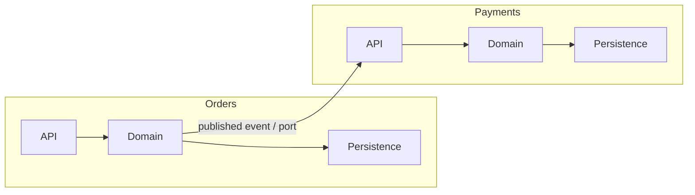

# Modularity

Modularity is the degree to which the system is divided into parts that can be understood, changed, tested, and replaced on their own. Almost every structural characteristic, [Maintainability](Maintainability.md), [Testability](Testability.md), [Deployability](Deployability.md), extensibility, is downstream of it.

### Cohesion and coupling

Two forces define a good module boundary:

- **Cohesion**: how much the things inside a module belong together. High cohesion means the module has one reason to exist.
- **Coupling**: how much a module depends on others' internals. Low coupling means a change inside one module does not ripple outward.

The goal is high cohesion, low coupling. A module split that raises coupling (every change touches three modules) is worse than no split at all.

### Connascence: a sharper vocabulary

Connascence describes *how* two pieces of code are coupled, ordered from weakest to strongest:

| Form | Two components must agree on... | Strength |
| --- | --- | --- |
| Name | The name of something | Weakest |
| Type | Its type |  |
| Meaning | The meaning of a value (`1` = active) |  |
| Position | Argument order |  |
| Algorithm | The same algorithm (e.g. a hash) |  |
| Timing / Execution order | When things happen | Strongest |

Two rules follow: **keep strong connascence local** (inside a module, not across boundaries), and **weaken it as it crosses distance**: replace positional arguments with a named object, replace magic values with an enum.

### Design tactics

- **Boundaries follow the business domain**, not technical layers. Look for parts that change for different reasons and at different rates.
- **Explicit, narrow interfaces.** Everything not exported is free to change; a large public surface is a large future commitment.
- **Dependencies point one way.** Cycles between modules mean you have one module wearing two names.
- **Shared code is coupling.** A "common" library used by every module recreates the monolith through the back door; duplicate a little rather than couple a lot.

### Modularity is not microservices

Modularity is a design property; deployment granularity is a separate decision. A well-modularised monolith ("modular monolith") is often the right answer: module boundaries enforced in code, single deployment unit. Distribute a module only when it has an independent reason to scale, fail, or release; otherwise you buy network calls, partial failure, and distributed debugging for nothing.

### Trade-offs

- Against **performance**: crossing a module boundary costs an indirection, and crossing a service boundary costs a network round trip.
- Against **simplicity**: too many modules turns one feature into a coordination exercise.
- Against **premature commitment**: boundaries drawn before the domain is understood are expensive to move. Start coarse, split along the seams the code reveals.

### Fitness functions

- Automated dependency rules: no cycles, no forbidden imports between modules (ArchUnit-style tests).
- Track how many modules a typical change touches; a rising number means the boundaries are wrong.
- Public API surface diff, so widening a module's interface is a deliberate reviewed act.

## Check Your Understanding

<quiz>
What does connascence add over simply saying "these modules are coupled"?

- [x] It classifies the strength and kind of coupling, giving concrete direction: keep strong forms local, weaken what crosses boundaries
> Correct. It turns "reduce coupling" into an actionable ranking of refactorings.
- [ ] It measures runtime performance of module calls
- [ ] It is a metric for test coverage between modules
- [ ] It requires modules to be deployed separately
</quiz>

<quiz>
A team splits a system into services, and now most changes require editing three of them. What happened?

- [x] The boundaries do not match how the system changes; coupling rose, so the split made things worse
> Correct. Deployment granularity without cohesive boundaries produces a distributed monolith.
- [ ] This is normal and expected for microservices
- [ ] The services need a shared library to fix it
- [ ] The problem is insufficient test coverage
</quiz>
