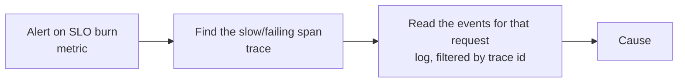

# Observability

Observability is the ability to understand what a system is doing internally from the signals it emits, including for failures nobody predicted. Monitoring answers questions you thought of in advance; observability lets you ask new ones during an incident without shipping code.

It is an enabling characteristic: [Availability](Availability.md), [Recoverability](Recoverability.md), and [Performance](Performance.md) all depend on being able to see the system.

### The three signals

| Signal | Answers | Cost |
| --- | --- | --- |
| **Metrics**: numeric time series | "Is something wrong, and since when?" | Cheap, low cardinality |
| **Logs**: discrete events | "What exactly happened for this request?" | Expensive at volume |
| **Traces**: causally linked spans across services | "Where did the time go, and which hop failed?" | Medium, usually sampled |

They work together: an alert fires on a metric, a trace localises the slow or failing hop, and logs for that trace explain it.

### Design tactics

- **Propagate a correlation / trace ID** through every hop, including asynchronous ones; put it in message headers, not only HTTP headers. Without this, logs from a distributed system are unjoinable.
- **Structured logs.** Key-value or JSON, not prose. Log at boundaries and decisions, with enough context (tenant, order ID, version) to filter, and never log secrets or personal data.
- **Instrument once, at the framework level**, so every new endpoint and consumer gets metrics and traces without the author remembering.
- **Measure the four golden signals** per service: latency, traffic, errors, saturation.
- **Emit business events, not just technical ones.** "Orders placed per minute" catches outages that CPU graphs miss.
- **Health endpoints that mean something**: liveness (should I be restarted?) separate from readiness (should I get traffic?).
- **Use an open standard** such as OpenTelemetry so instrumentation outlives the vendor.

### Alert on symptoms, not causes

Page on what users experience, error rate, latency, SLO error-budget burn, and leave resource metrics as diagnostic dashboards. Alerts that fire on high CPU without user impact train people to ignore alerts, which is worse than having none.

### Trade-offs

- Against **cost**: telemetry volume can rival infrastructure spend. Sample traces, aggregate logs, and control metric cardinality, a label containing a user ID creates millions of series.
- Against **performance**: instrumentation adds overhead on the hot path; keep it asynchronous and bounded.
- Against **privacy and security**: logs are an exfiltration path. Redact at the source, not in the query.

### Fitness functions

- A CI check that every service exports the standard metrics and propagates trace headers.
- Synthetic incident drills: given only the dashboards, can the on-call locate a seeded fault within N minutes?
- Cardinality and log-volume budgets alerting before the bill does.

## Check Your Understanding

<quiz>
Why should alerts fire on symptoms rather than causes?

- [x] Symptom-based alerts map to user impact, while cause-based alerts fire without impact and train people to ignore them
> Correct. Error rate and latency belong in alerts; CPU belongs on a diagnostic dashboard.
- [ ] Because causes cannot be measured reliably
- [ ] Because symptom alerts are cheaper to store
- [ ] Because tracing replaces the need for alerting
</quiz>

<quiz>
What makes logs from a distributed system usable during an incident?

- [x] A correlation/trace ID propagated through every hop, including message headers, so one request's events can be joined
> Correct. Without shared identity, per-service logs cannot be assembled into one story.
- [ ] Logging at DEBUG level in production
- [ ] Writing logs as free-form prose for readability
- [ ] Keeping each service's logs in a separate system
</quiz>
