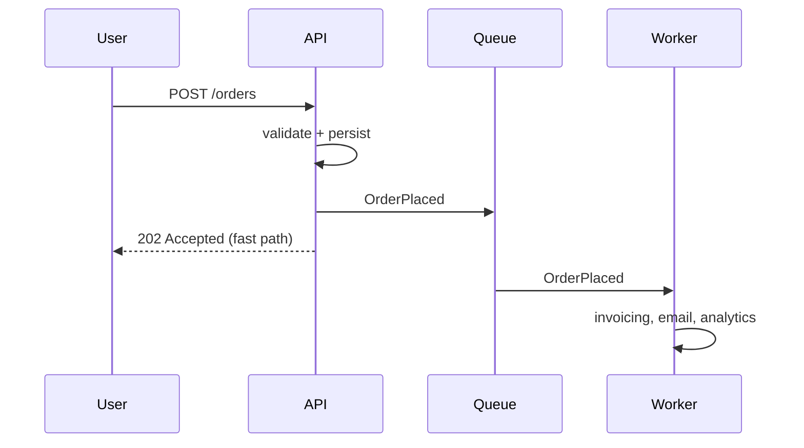

# Performance

Performance is how fast the system responds and how much work it gets through. It splits into two distinct measures that are often confused:

- **Latency**: time to serve one request, end to end.
- **Throughput**: requests (or records, or messages) completed per unit of time.

Optimising one can hurt the other: batching raises throughput and raises latency; per-request dedicated resources cut latency and cut throughput.

### How it is measured

Never state performance as an average. A mean hides the tail where users actually suffer. Use percentiles:

| Metric | Meaning |
| --- | --- |
| p50 | The typical experience |
| p95 / p99 | The slow requests users complain about |
| p99.9 | The tail that dominates for users making many requests per page |

A usable requirement names the operation, the percentile, the load, and the environment: *"checkout submission completes in under 400 ms at p99, at 2000 concurrent users, in production."*

### Design tactics

- **Do less work.** Remove N+1 queries, avoid chatty service calls, return fewer fields. The fastest call is the one not made.
- **Cache.** Client, CDN, application, and database caches, in that order of preference, the earlier the layer, the more work skipped. Costs consistency.
- **Move work off the request path.** Reply as soon as the request is durably accepted and process the rest asynchronously with a queue.
- **Precompute.** Materialised views and read models turn expensive joins into a lookup.
- **Right-size the data path.** Indexes, pagination, streaming instead of buffering, compression on slow links.
- **Concurrency.** Parallel fan-out for independent calls; connection and thread pools sized to the downstream capacity, not to hope.

### Latency has a floor

Some costs cannot be optimised away, only relocated: network round trips, disk seeks, TLS handshakes, cold starts. Know the rough numbers: an in-memory read is nanoseconds, an SSD read microseconds, a same-region round trip a millisecond, a cross-continent round trip over 100 ms. If a design needs five sequential cross-region calls, no amount of code tuning will save it.

### Trade-offs

- Against **consistency**: caches and read replicas serve stale data.
- Against **maintainability**: denormalised schemas, hand-tuned queries, and custom serialisation are harder to change.
- Against **scalability**: a design tuned for a single fast machine may not distribute at all.
- Against **security**: encryption, token validation, and auditing all cost time on the request path.

### Fitness functions

- Load tests in CI with a p99 budget that fails the build on regression.
- Per-endpoint latency SLOs with alerting on error budget burn.
- A performance budget per page (bytes, requests, time to interactive) enforced by a build check.

## Check Your Understanding

<quiz>
Why is a mean response time a poor performance requirement?

- [x] It hides the slow tail, where the requests users actually complain about live
> Correct. Percentiles such as p95 and p99 describe the worst experiences that an average conceals.
- [ ] It cannot be measured in production
- [ ] It always overstates how fast the system is
- [ ] It applies only to batch processing
</quiz>

<quiz>
Batching many small writes into one larger write usually...

- [x] Raises throughput while raising per-request latency
> Correct. Latency and throughput are distinct and often traded against each other.
- [ ] Raises both throughput and latency performance equally
- [ ] Lowers throughput but improves latency
- [ ] Has no effect on either
</quiz>
