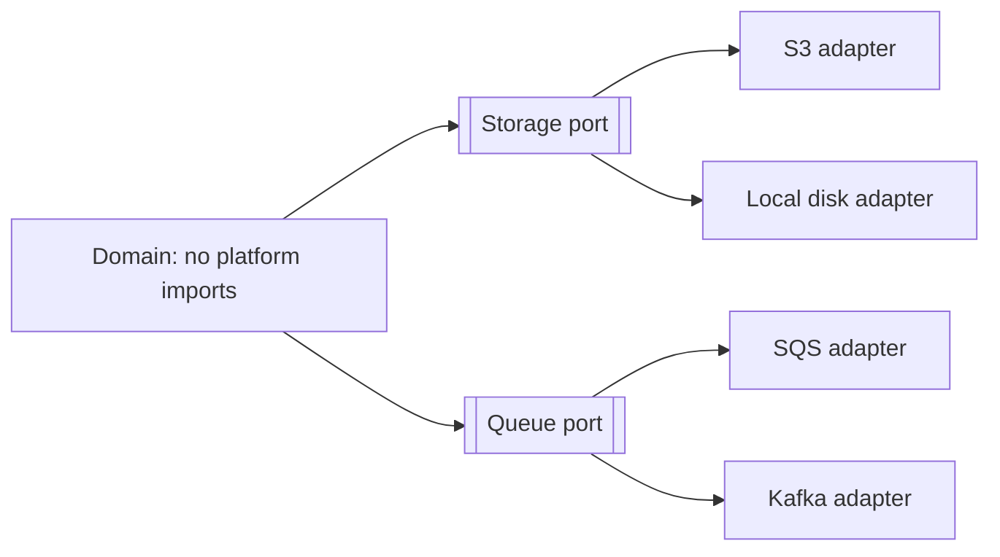

# Portability

Portability is how easily the system can be moved to a different environment, another cloud, another operating system, another database, another runtime, with limited change.

Its close relative is **interoperability**: the ability to work *with* other systems. Portability is about substituting what you run on; interoperability is about talking to what you do not control.

### Why it is usually over-bought

Portability is the characteristic teams most often pay for and never use. A full database abstraction layer, built so the system "could switch from PostgreSQL to Oracle", costs every query for years to serve a migration that never happens. Ask first:

1. Is there a concrete, dated reason to move (contract, regulation, acquisition, exit clause)?
2. What is the actual cost of migrating later without the abstraction?
3. Is the abstraction's cost lower than that, discounted by the probability of moving?

If the answers do not clearly favour portability, buy deeply into the platform and keep the code simple. Otherwise you get the worst of both: the lowest common denominator of every platform, and none of their strengths.

### Design tactics, when it is genuinely needed

- **Isolate the platform behind ports.** Keep cloud SDKs, filesystem access, and vendor clients in adapters at the edge, never inside the domain, see [Hexagonal Architecture](../Architectural%20Patterns/Hexagonal.md).
- **Prefer open standards and protocols**: SQL over vendor extensions, S3-compatible APIs, OpenTelemetry, OCI containers, POSIX-ish assumptions.
- **Containerise.** An OCI image with no host-specific assumptions runs anywhere a runtime exists.
- **Externalise everything environment-specific** into configuration; see [Configurability](Configurability.md).
- **Keep data exportable.** The heaviest part of any migration is state, bulk export, schema documentation, and no logic embedded in vendor-specific stored procedures.

### A cheaper middle ground

Rather than full portability, aim for **replaceability of the pieces most likely to change** and accept lock-in elsewhere. Managed services usually justify their lock-in through the operational burden they remove; the exception is anything holding your data, where an export path should always exist.

### Trade-offs

- Against **simplicity and maintainability**: every abstraction layer is code to read and maintain.
- Against **performance and capability**: portable code cannot use the platform's best features, which are exactly what you paid for.
- Against **delivery speed**: portability work delivers no user-visible value today.

### Fitness functions

- A dependency test asserting the domain package imports no vendor SDK.
- Running the integration suite against two adapter implementations (for example, the real store and a local one) in CI.
- A rehearsed data-export drill proving state can leave the platform within a known time.

## Check Your Understanding

<quiz>
When is investing in database portability usually a poor trade?

- [x] When there is no concrete plan to migrate, since the abstraction's ongoing cost buys only the lowest common denominator of both engines
> Correct. Speculative portability is a standing tax paid for an event that typically never occurs.
- [ ] Whenever the application uses an ORM
- [ ] When the team uses containers
- [ ] When the database is managed by a cloud provider
</quiz>

<quiz>
What distinguishes portability from interoperability?

- [x] Portability is moving the system onto a different platform; interoperability is working with other systems you do not control
> Correct. One substitutes the substrate, the other integrates across boundaries.
- [ ] They are the same characteristic under different names
- [ ] Portability applies to data, interoperability to code
- [ ] Portability concerns only operating systems
</quiz>
