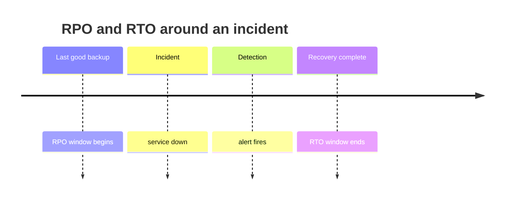

# Recoverability

Recoverability is how quickly and completely the system returns to normal operation after a failure or disaster, a crashed process, a corrupted table, a deleted bucket, a lost region.

### The two numbers that define it

| Objective | Question | Determined by |
| --- | --- | --- |
| **RTO**: Recovery Time Objective | How long may we be down? | Failover automation, restore speed, runbooks |
| **RPO**: Recovery Point Objective | How much data may we lose? | Backup frequency, replication mode |

An RPO of zero requires synchronous replication, which costs latency on every write. An RTO of minutes requires a warm or hot standby, which costs money continuously. Both numbers are business decisions, not technical ones; the architect's job is to state the price of each.

### Standby strategies

| Strategy | RTO | Relative cost |
| --- | --- | --- |
| Backup and restore | Hours to days | Lowest |
| Pilot light (core data replicated, compute off) | Tens of minutes | Low |
| Warm standby (scaled-down live copy) | Minutes | Medium |
| Active-active (all regions serving) | Near zero | Highest |

### Design tactics

- **Backups that are tested.** An untested backup is a hypothesis. Restore drills on a schedule are the only proof.
- **Backups that are isolated.** Versioned, immutable, in a separate account or region; otherwise the same compromise or the same script deletes both copies.
- **Replayable event log.** If the system's state can be rebuilt from an ordered log of events, recovery becomes replay, and corrupted projections can simply be rebuilt.
- **Health checks and automated failover** to cut detection and decision time out of the RTO.
- **Runbooks.** Whatever is not automated must be written down and rehearsed; nobody designs recovery well at 3am.
- **Reversible deployments.** Most "disasters" are the release you just shipped, so a one-command rollback is the highest-value recovery mechanism you can own. See [Deployability](Deployability.md).

### Trade-offs

- Against **performance and cost**: synchronous cross-region replication buys RPO 0 and pays in write latency; hot standbys buy RTO and pay in idle infrastructure.
- Against **consistency**: promoting a standby that lagged means accepting the loss of the unreplicated tail.
- Against **simplicity**: multi-region failover introduces split-brain risk that must itself be designed against.

### Fitness functions

- Scheduled restore drills that measure actual RTO and RPO and fail if they exceed the target.
- Game days: fail over a region in production or a production-like environment.
- An automated check that every datastore has a backup schedule and a verified last-successful-restore timestamp.

## Check Your Understanding

<quiz>
A business states "we may lose at most five minutes of data." Which objective is that?

- [x] RPO: the recovery point objective, driven by backup frequency and replication mode
> Correct. RPO bounds data loss; RTO bounds downtime.
- [ ] RTO: the recovery time objective
- [ ] MTBF: mean time between failures
- [ ] The availability SLO
</quiz>

<quiz>
Why is an untested backup considered no backup at all?

- [x] Restores fail for reasons backups never reveal: missing schemas, bad credentials, corrupt archives. Only a rehearsed restore proves recoverability
> Correct. Recovery time and completeness can only be measured by actually recovering.
- [ ] Because backups expire after 30 days by default
- [ ] Because encrypted backups cannot be restored
- [ ] Because backups do not count toward the RTO
</quiz>
