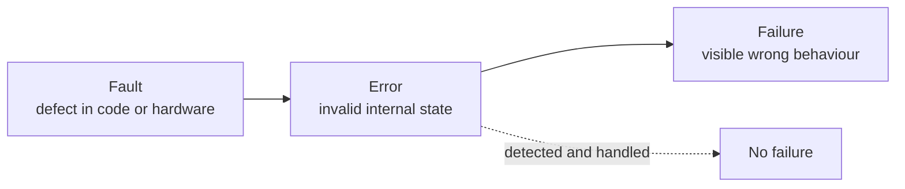

# Reliability

Reliability is the system's ability to keep performing correctly, including under failure. [Availability](Availability.md) asks *"does it answer?"*; reliability asks *"is the answer right, every time, and does the work eventually complete?"* A payment service that responds instantly but occasionally double-charges is available and unreliable.

Two neighbouring terms:

- **Safety-critical**: failure can cause injury or loss of life. Demands far heavier verification.
- **Fault tolerance**: the ability to keep operating when a component fails; one of the means to reliability.

### How it is measured

- **MTBF**: mean time between failures.
- **Failure rate**: errors per million operations, or per request.
- **Data loss / corruption events**: usually a hard target of zero.
- **Successful completion rate** for asynchronous work, not just HTTP status codes.

### Fault, error, failure

Reliability tactics attack each arrow: prevent faults, detect errors early, and stop errors from escalating into failures.

### Design tactics

- **Fail fast, at the boundary.** Validate input where it enters the system so bad data never reaches the core. See [Rules of Software Architecture](../Rules%20of%20Software%20Architecture.md).
- **Idempotency and exactly-once *effects*.** Networks retry; make repeated delivery harmless with idempotency keys and deduplication.
- **Transactional integrity.** Use one transaction where possible; where boundaries force distribution, use the outbox pattern or sagas with compensating actions rather than a two-phase commit.
- **Timeouts, retries with backoff and jitter, circuit breakers.** Retries without backoff turn a blip into a self-inflicted denial of service.
- **Dead letter queues.** Failed messages must be visible and replayable, never silently dropped.
- **Redundancy and quorum** for data durability; replicate before acknowledging a write when loss is unacceptable.
- **Graceful degradation.** Decide in advance which features may be shed under stress.

### Trade-offs

- Against **performance**: synchronous replication, checksums, and durable acknowledgements all cost latency.
- Against **availability**: refusing to serve when correctness cannot be guaranteed lowers uptime on purpose, the right call for money and health data.
- Against **cost and complexity**: sagas and compensating transactions are substantially more code than a single database transaction.

### Fitness functions

- Fault injection: drop packets, add latency, kill a broker, and assert no data loss and no duplicate side effects.
- A test asserting the same request with the same idempotency key produces exactly one effect.
- Continuous reconciliation jobs comparing derived state to the source of truth and alerting on drift.

## Check Your Understanding

<quiz>
Which system is available but not reliable?

- [x] A service that always responds quickly but occasionally charges a customer twice
> Correct. Availability is about answering; reliability is about answering correctly and consistently.
- [ ] A service that is down for two hours a month but never loses data
- [ ] A service behind a load balancer with two replicas
- [ ] A service with a 200 ms p99 latency
</quiz>

<quiz>
Why do retries need backoff and jitter?

- [x] Without them, synchronised retries amplify a small failure into a self-inflicted overload
> Correct. Immediate, aligned retries from many clients create a thundering herd that keeps the dependency down.
- [ ] Because retries are otherwise forbidden by HTTP
- [ ] Because backoff guarantees idempotency
- [ ] Because jitter encrypts the retry traffic
</quiz>
