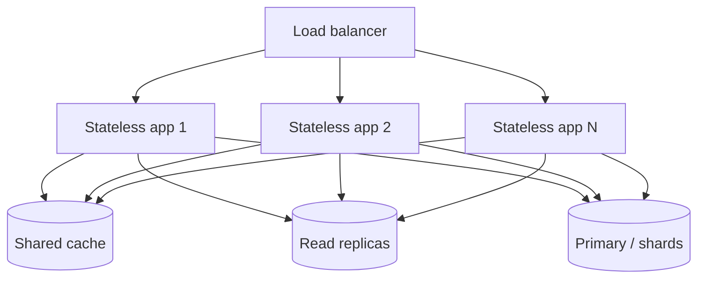

# Scalability

Scalability is the ability to keep serving acceptable response times as load grows. A system is scalable when adding resources buys proportional capacity, not when it merely survives today's traffic.

### Vertical vs horizontal

| | Vertical (scale up) | Horizontal (scale out) |
| --- | --- | --- |
| Method | Bigger machine | More machines |
| Limit | Hardware ceiling | Coordination and shared state |
| Availability | Still a single point of failure | Redundancy comes for free |
| Complexity | Low | Distributed systems problems |
| Cost curve | Superlinear at the high end | Roughly linear |

Vertical scaling is the lazy correct answer for a long time. Move to horizontal when the ceiling is real, not anticipated.

### The state problem

Horizontal scaling is easy for stateless components and hard for stateful ones. The core tactic is to **push state out of the compute tier**:

- Sessions in a shared store or a signed token, not in process memory.
- No sticky sessions, so any instance can serve any request.
- Uploaded files in object storage, not on local disk.

The database then becomes the bottleneck, addressed by read replicas, caching, sharding by a well-chosen key, or splitting into per-service datastores.

### Other tactics

- **Asynchrony.** A queue absorbs bursts and lets consumers scale independently of producers.
- **Partitioning by workload.** Separate the read-heavy path, the write path, and the batch path so each scales on its own curve. This is the reasoning behind [Microservice Architecture](../Architectural%20Patterns/Microservice%20Architecture.md).
- **Backpressure and load shedding.** A system that accepts more than it can process fails worse than one that rejects early.
- **Idempotency.** Retries and redelivery are inevitable once work is distributed.

### Amdahl's law

Speedup is limited by the part that cannot be parallelised. With a serial fraction $s$ and $n$ workers:

$$
S(n) = \frac{1}{s + \dfrac{1 - s}{n}}
\qquad\Longrightarrow\qquad
\lim_{n \to \infty} S(n) = \frac{1}{s}
$$

So if 5% of the work is a serialised section (a global lock, a single sequence generator, one shared table row), then $s = 0.05$ and no amount of extra instances gets you past $1/0.05 = 20\times$. Hunt for the serial section before buying capacity.

### Trade-offs

- Against **simplicity and debuggability**: distributed traces replace stack traces.
- Against **consistency**: sharding and replication push you toward eventual consistency.
- Against **cost**: capacity provisioned for peak sits idle off-peak, which is what [Elasticity](Elasticity.md) addresses.

### Fitness functions

- Load tests at 2×, 5×, 10× current peak, asserting latency stays within the SLO.
- A test that kills instance affinity (sticky sessions off) and asserts sessions still work.
- Automated check that no service writes to local disk for durable state.

## Check Your Understanding

<quiz>
Why must application instances usually be stateless to scale horizontally?

- [x] So any instance can serve any request, letting instances be added, removed, or replaced freely
> Correct. In-process state forces sticky routing and blocks free redistribution of load.
- [ ] Because stateless code runs faster per request
- [ ] Because load balancers cannot use HTTP with stateful servers
- [ ] Because databases refuse concurrent connections otherwise
</quiz>

<quiz>
A system spends 5% of its work in a globally serialised section. What does that imply?

- [x] Total speedup is capped near 20×, regardless of how many instances are added
> Correct. Amdahl's law: the non-parallelisable fraction bounds the achievable speedup.
- [ ] Nothing, since 5% is negligible
- [ ] Speedup grows linearly with instance count anyway
- [ ] The system cannot be scaled vertically either
</quiz>
