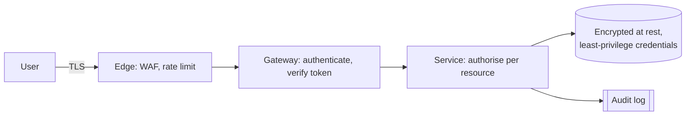

# Security

Security is the system's ability to protect data and functionality from unauthorised access, modification, or disclosure. It is a **cross-cutting** characteristic: it constrains every layer, and unlike most characteristics it has an active adversary rather than a statistical failure mode.

### The properties being protected

- **Confidentiality**: only authorised parties can read the data.
- **Integrity**: data cannot be altered undetected.
- **Availability**: the system stays usable (see [Availability](Availability.md); denial of service is a security concern too).
- **Authenticity**: the claimed identity is real.
- **Non-repudiation / auditability**: actions can be attributed after the fact.

### Design principles

- **Defence in depth.** No single control is trusted alone; a bypassed WAF should still meet authorisation checks in the service.
- **Least privilege.** Every service, credential, and person gets the narrowest scope that works, with short lifetimes.
- **Secure by default.** Deny unless explicitly allowed. New endpoints must require authentication because the framework says so, not because someone remembered.
- **Validate at trust boundaries.** Everything crossing into the system, request bodies, headers, files, messages from other services, is untrusted input, validated against an allow-list.
- **Minimise the attack surface and the data.** Data you never store cannot leak; endpoints you never expose cannot be attacked.
- **Fail securely.** An error in an authorisation check must deny, never fall through to allow.
- **No security by obscurity.** Assume the design is public; only keys are secret.

### Concrete practices

- **Authentication vs authorisation.** Authentication proves who; authorisation decides what. Authorisation must be checked per resource in the service, not only at the gateway, a valid token is not permission to read someone else's order.
- **Encrypt in transit and at rest.** TLS everywhere, including inside the network.
- **Hash passwords with a slow, salted algorithm** (bcrypt, scrypt, Argon2). Never encrypt them, never invent the scheme.
- **Parameterised queries and safe encoding** to close injection classes structurally rather than by review.
- **Manage secrets** in a dedicated store with rotation; never in the repository or the image. See [Configurability](Configurability.md).
- **Patch dependencies.** Most breaches use known vulnerabilities in old libraries, not novel attacks.
- **Log security events**: authentication, authorisation failures, privilege changes, without logging the secrets themselves.

### Trade-offs

- Against **usability**: every additional check is friction; make the secure path the easy path rather than adding steps.
- Against **performance**: encryption, token validation, and auditing all cost latency.
- Against **deployability**: strict change control conflicts with frequent releases; automate the controls into the pipeline instead of gating with humans.

### Fitness functions

- Dependency and container scanning failing the build on known critical CVEs.
- Static analysis and secret scanning on every commit.
- An automated test asserting every route requires authentication unless explicitly annotated public.
- Regular penetration tests and threat-modelling reviews on architectural changes.

## Check Your Understanding

<quiz>
A valid, authenticated token arrives at a service requesting order #5001, which belongs to another customer. What must happen?

- [x] The service performs its own per-resource authorisation check and denies the request
> Correct. Authentication at the gateway does not establish permission for a specific resource; skipping this check is the insecure-direct-object-reference flaw.
- [ ] The gateway already validated the token, so the service should serve it
- [ ] The request should be allowed but logged for review
- [ ] The service should encrypt the response instead
</quiz>

<quiz>
What does "fail securely" mean for an authorisation check that throws an exception?

- [x] The outcome must be denial, never an accidental fall-through to allow
> Correct. Error paths are the most commonly overlooked bypass.
- [ ] The exception should be hidden from logs
- [ ] The request should be retried until it succeeds
- [ ] The user should be logged out of all sessions
</quiz>
