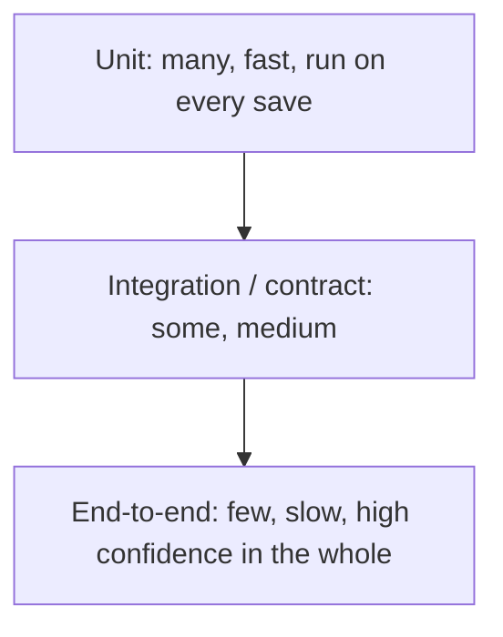

# Testability

Testability is how easily and cheaply the system's correctness can be verified. It is a property of the *design*, not of the test suite: some architectures make good tests trivial, and others make them impossible no matter how much effort the team spends.

### The four properties that make code testable

1. **Controllability**, can you put the system into the state you want to test? Hard-coded clocks, random values, and singletons destroy this.
2. **Observability**, can you see the outcome? Logic whose only output is a side effect deep in a third-party call is not observable.
3. **Isolability**, can you test one part without the rest? Requires seams: interfaces, dependency injection, ports.
4. **Determinism**, does the same input always give the same result? Time, randomness, concurrency, and shared test data are the usual culprits behind flaky tests.

### The test pyramid, and where architecture shows up

If a team's pyramid is inverted, mostly end-to-end tests, the cause is almost always architectural: business logic entangled with I/O, so it cannot be exercised without the whole system running.

### Design tactics

- **Separate decisions from effects.** Pure functions computing *what* to do, thin adapters performing it. This single split converts most integration tests into unit tests.
- **Inject dependencies**, including the clock, the ID generator, and the random source.
- **Ports and adapters** give a natural test double at every boundary; see [Hexagonal Architecture](../Architectural%20Patterns/Hexagonal.md).
- **Contract tests** between services, so each side can be tested independently while still catching interface drift, the alternative is a full environment for every test.
- **Test data builders and disposable environments** (containers, in-memory or ephemeral databases) rather than a shared staging database everyone mutates.
- **Expose state deliberately**: health endpoints, structured logs, and domain events make outcomes observable without reaching into internals.

### Trade-offs

- Against **short-term speed**: seams and injection are extra code up front.
- Against **simplicity**: interfaces added purely for testing can be over-applied, do not create one for every class, only at real boundaries.
- Against **realism**: heavy mocking makes fast tests that pass while production breaks. Cover the seams with contract or integration tests.

### Fitness functions

- Coverage gate on *changed* lines rather than on the whole codebase.
- Mutation testing on the core domain to check that tests actually assert something.
- A CI check for flaky tests: re-run the suite and fail on non-deterministic results.
- A build rule that unit tests may not open sockets or touch the filesystem.

## Check Your Understanding

<quiz>
A team's suite is mostly slow end-to-end tests. What is the usual root cause?

- [x] Business logic is entangled with I/O, so it cannot be exercised in isolation
> Correct. An inverted pyramid is a design symptom, not a discipline problem.
- [ ] The team lacks a unit test framework
- [ ] End-to-end tests are inherently more accurate, so they were chosen
- [ ] The CI machines are too slow
</quiz>

<quiz>
Why inject the system clock instead of calling it directly?

- [x] It restores controllability and determinism, letting tests set the time instead of waiting for it
> Correct. Hidden global state is the most common cause of untestable and flaky logic.
- [ ] Because reading the clock is slow
- [ ] Because time zones cannot be handled otherwise
- [ ] Because the standard library forbids direct calls
</quiz>
