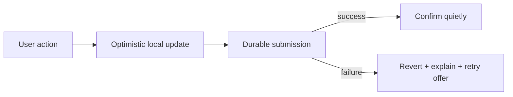

# Usability

Usability is how effectively, efficiently, and comfortably people can achieve their goals with the system. It is usually treated as a UI concern, but architecture decides much of it: what the interface can offer, how fast it responds, what it can do offline, and how it behaves when something fails.

**Accessibility** means usability for people with disabilities. It is not a subset to trade away. Treat WCAG conformance as a requirement, like security.

### How it is measured

| Measure | Example |
| --- | --- |
| Task success rate | % of users completing checkout unaided |
| Time on task | Median seconds to submit a claim |
| Error rate and recovery | Form submissions rejected, and how many recover |
| Learnability | Time for a new user to complete the core task |
| Satisfaction | SUS score, CSAT |
| Accessibility conformance | WCAG 2.2 AA audit findings |

### Where architecture affects usability

- **Latency budgets.** Roughly: under 100 ms feels instant, under 1 s keeps flow, over 10 s loses attention. Interaction design cannot rescue an architecture that needs four sequential cross-region calls. See [Performance](Performance.md).
- **Optimistic UI and asynchrony.** Accepting work and confirming later (202-style) requires an architecture with durable queues and a way to report the outcome.
- **Undo instead of confirm.** Cheap reversal is far better than a modal asking "are you sure?", but it requires the domain to model reversal, which is an architectural decision.
- **Graceful degradation.** When the recommendations service is down, hide the widget; do not fail the page. This requires isolation and timeouts by design.
- **Meaningful errors.** A user-facing message needs a correlation ID and an actionable next step, which depends on [Observability](Observability.md) plumbing.
- **Offline and poor-connectivity support.** Local-first storage and sync-on-reconnect are architectural commitments made early or not at all.
- **Consistency across surfaces.** A shared API contract and design system keep web, mobile, and partner integrations behaving alike.

### Trade-offs

- Against **security**: every extra verification step is friction. Prefer controls that are invisible when things are normal, risk-based step-up rather than blanket obstacles.
- Against **configurability**: options offered to users are options someone must understand; good defaults beat many settings.
- Against **consistency**: optimistic UI shows state that may later be reverted, and that reversal must be designed, not improvised.

### Fitness functions

- Automated accessibility checks (axe, Lighthouse) failing the build on regressions.
- Real user monitoring of core web vitals and per-flow completion rates.
- A synthetic test of the primary user journey, alerting when its duration exceeds the budget.

## Check Your Understanding

<quiz>
Which usability improvement is primarily an architectural decision rather than a UI one?

- [x] Supporting undo for a destructive action, which requires the domain to model reversal
> Correct. Reversibility must exist in the data and domain model; the button is the easy part.
- [ ] Choosing a larger font for the confirmation dialog
- [ ] Changing the button colour to increase contrast
- [ ] Rewording an error message
</quiz>

<quiz>
The recommendations service is down. What is the usable architectural behaviour?

- [x] Time out quickly and render the page without the widget
> Correct. Isolation, timeouts, and graceful degradation keep a non-essential dependency from failing the whole experience.
- [ ] Return a 500 for the whole page so the user knows something is wrong
- [ ] Retry indefinitely until recommendations load
- [ ] Block rendering and show a spinner until recovery
</quiz>
