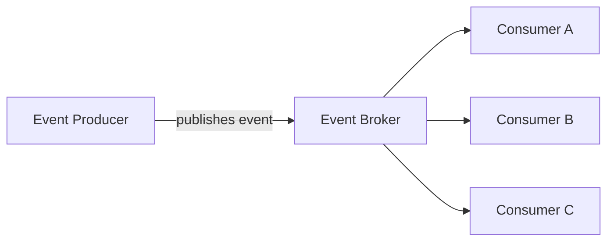

# Event-Driven Architecture (EDA)

System components communicate asynchronously via events/messages.

### Components:

- **Event Producer**: Generates and publishes events.
- **Event Consumer**: Listens and reacts to events.
- **Event Broker**: Manages event flow.

### Structure:

### Example:

A food delivery system can use Event-Driven Architecture:

- **Event Producer**: Order service publishes `OrderPlaced`.
- **Event Broker**: Kafka, RabbitMQ, or a cloud event bus routes the event.
- **Event Consumers**: Payment service charges the customer, restaurant service notifies the restaurant, and delivery service looks for a driver.

The producer does not need to call every service directly; it publishes an event and interested consumers react independently.

### Pros:

- Loose coupling and flexibility.
- Highly scalable and adaptable.

### Cons:

- Complexity in debugging event flows.
- Challenges in event versioning and consistency.

### When to use:

- Real-time applications.
- Systems requiring asynchronous handling and scalability (IoT, real-time analytics).

## Check Your Understanding

<quiz>
What characterises an Event-Driven Architecture?

- [x] Components communicate by producing and consuming events, without knowing who consumes them
> Correct. That indirection gives loose coupling and easy extension, but makes end-to-end flows harder to trace and usually only eventually consistent.
- [ ] Every call is a synchronous request that waits for a reply
- [ ] All components share a single database schema
- [ ] Components are ordered in a strict top-down hierarchy
</quiz>
