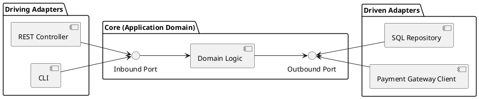

# Hexagonal (Ports & Adapters) Architecture

Proposed by Alistair Cockburn, focuses on creating systems independent from external interfaces.

### Components:

- **Core Application (Domain)**: Business logic and domain rules.
- **Ports**: Interfaces defining communication channels to/from the Core.
- **Adapters**: Concrete implementations of ports.

### Structure:

### Example:

A payment system can use Hexagonal Architecture:

- **Core Application**: Payment authorization, refund rules, and fraud checks.
- **Ports**: Interfaces such as `PaymentGateway`, `PaymentRepository`, and `NotificationSender`.
- **Adapters**: Stripe adapter, SQL repository, fake test gateway, and email adapter.

The core payment logic depends on ports, so the team can replace Stripe with another provider without rewriting the business rules.

### Pros:

- Highly testable due to clean separation.
- Easily replaceable external integrations.

### Cons:

- Requires significant discipline in keeping ports/adapters clean.
- High initial overhead.

### When to use:

- Microservices architecture.
- Systems with multiple external dependencies (DB, APIs, messaging).
