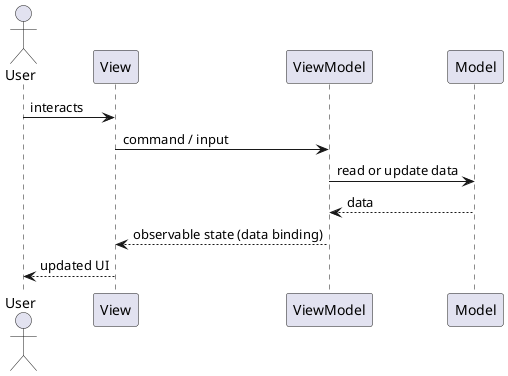

# Model-View-ViewModel (MVVM)

MVVM introduces a ViewModel to mediate between View and Model.

### Components:

- **Model**: Data and business logic.
- **View**: UI component displaying data.
- **ViewModel**: Mediates data from Model to View, handling UI-specific logic.

### Interaction Flow:

### Example:

A mobile weather app can use MVVM:

- **Model**: Weather forecast data and location information.
- **View**: Screens that display current temperature, hourly forecast, and alerts.
- **ViewModel**: Formats temperatures, exposes loading/error states, and prepares data for the View.

When the forecast refreshes, the ViewModel updates its observable state and the View automatically re-renders.

### Pros:

- Simplifies UI testing.
- ViewModel can easily bind with View (data binding).

### Cons:

- Complexity in handling asynchronous data.
- ViewModel can become bloated.

### When to use:

- Client-side applications with complex UI (e.g., Android apps, WPF apps, React/Angular apps).
