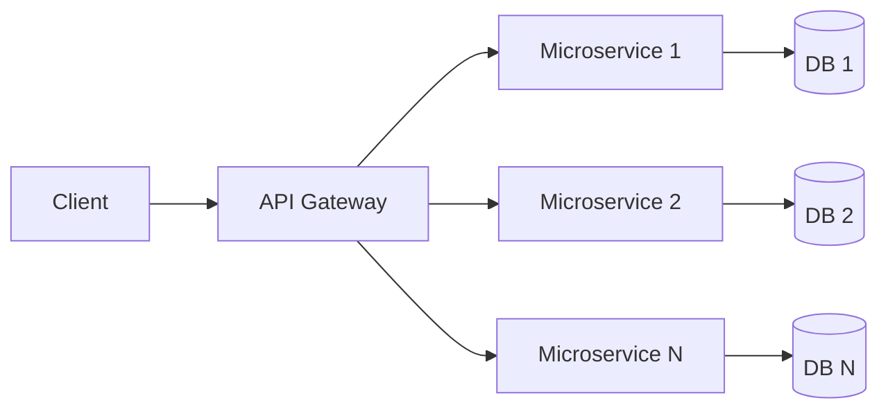

# Microservices Architecture

Builds applications as independent, loosely coupled services.

### Components:

- Independent services with specific functionality.
- Services communicate over network (usually via HTTP APIs or message queues).

### Structure:

### Example:

An e-commerce platform can be split into microservices:

- **Product Service**: Manages product catalog and search.
- **Order Service**: Handles carts, checkout, and order history.
- **Payment Service**: Processes payments and refunds.
- **Notification Service**: Sends emails, SMS messages, or push notifications.

Each service owns its own logic and can be deployed or scaled independently.

### Pros:

- Independent scaling.
- Flexibility in choosing technology per service.

### Cons:

- Higher complexity in orchestration.
- Challenges with data consistency and latency.

### When to use:

- Large-scale distributed systems.
- Continuous deployment scenarios.
