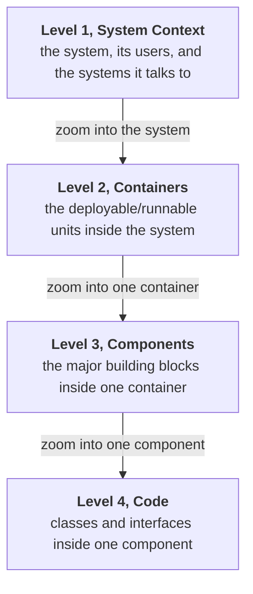
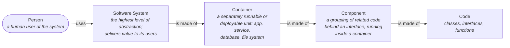
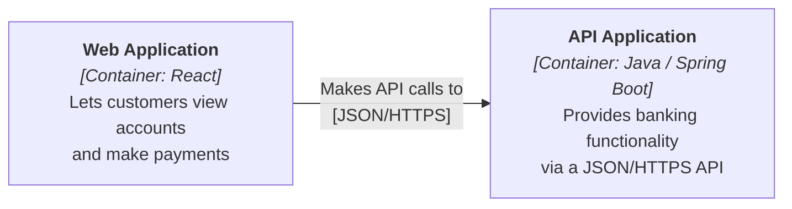
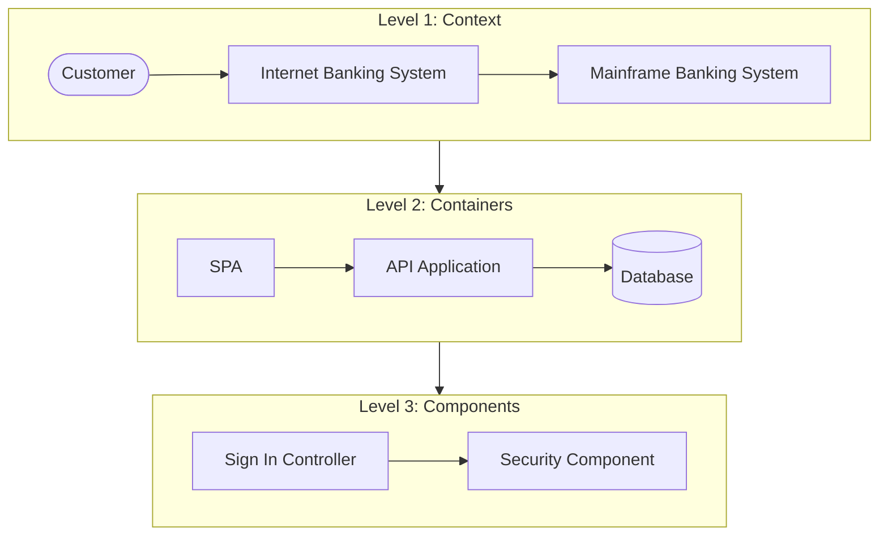

# C4 Modeling

C4 is a way to draw software architecture as a small set of diagrams at **four levels of zoom**: Context, Containers, Components, and Code. Each level shows the same system with more detail, in the same way you zoom from a world map to a street map. It was created by Simon Brown as a lightweight alternative to full UML modelling: the notation is deliberately loose, the discipline is in the levels and the labels.

The point of C4 is to fix the two failures of most architecture diagrams: mixing abstraction levels in one picture (a box for "AWS" next to a box for `OrderValidator`), and leaving boxes and lines unlabelled so only the author can read them.

### The four levels

| Level | Scope | Audience | Typical count |
| --- | --- | --- | --- |
| 1. Context | One software system | Everyone, technical or not | 1 diagram |
| 2. Container | One software system | Technical staff, ops | 1 diagram |
| 3. Component | One container | Developers of that container | 1 per interesting container |
| 4. Code | One component | Developers, when it earns its keep | Rarely drawn by hand |

The pyramid narrows as it deepens: one Context diagram, one Container diagram, a handful of Component diagrams, and almost no Code diagrams. Levels 3 and 4 go stale fastest, which is why most teams stop at level 2 and generate anything deeper from the code.

### The vocabulary

C4 defines only a few nouns, and being strict about them is what makes the diagrams comparable across teams.

!!! warning "A container is not a Docker container"
    In C4, *container* means "something that hosts code or data and can run independently": a Spring Boot service, a single-page application, a mobile app, a database schema, a message broker. Docker predates neither the term nor invalidates it, but the overlap is a permanent source of confusion; say "deployment unit" when talking to a room that will hear "Docker".

### Every box and every line is labelled

A C4 element carries three things: **name**, **type/technology**, and a one-line **description**. A C4 relationship carries a **verb phrase** and, where useful, the **protocol**.

Unlabelled arrows are the most common defect in architecture diagrams: the reader cannot tell data flow from dependency, synchronous from asynchronous, or who initiated the call. C4's rule is that the diagram must stand alone without its author in the room.

### Notation is not prescribed

C4 says nothing about colours, shapes, or tooling. Boxes and arrows drawn on a whiteboard, Mermaid, PlantUML with the C4-PlantUML library, Structurizr DSL, or diagrams.net all qualify. What C4 requires is:

- a **title** naming the diagram type and its scope ("System Context diagram for Internet Banking System");
- a **legend** explaining shapes and colours, because there is no standard;
- **no acronyms** that a new joiner would have to ask about.

### The running example

The rest of this section models one system, an internet banking product, at each level:

Continue with [Level 1, System Context](Level%201%20-%20System%20Context.md).

### Where C4 fits

C4 replaces neither ADRs nor quality-attribute work. It describes *structure*; it does not record *why* the structure is that way, nor what it must be good at. Pair it with:

- [Architectural Characteristics](../Architectural%20Characteristics/index.md) for the qualities the structure must deliver.
- Architecture Decision Records for the reasoning behind each significant choice.
- [Architectural Patterns](../Architectural%20Patterns/Layered%20Architecture.md) for the shapes the boxes tend to take.

## Check Your Understanding

<quiz>
What distinguishes the four C4 levels from one another?

- [x] The level of abstraction: each level zooms into one element of the level above
> Correct. Context zooms into containers, a container zooms into components, a component zooms into code.
- [ ] The lifecycle phase in which each diagram is drawn
- [ ] The notation used, since each level has a required shape set
- [ ] The team that owns the diagram
</quiz>

<quiz>
Why does C4 insist that every arrow carries a verb phrase and often a protocol?

- [x] Because an unlabelled arrow leaves direction, purpose, and mechanism ambiguous, so the diagram only works with its author present
> Correct. Self-describing diagrams are the whole point; labels are what make them readable months later.
- [ ] Because UML requires labelled associations
- [ ] Because tooling cannot lay out unlabelled edges
- [ ] Because arrows must map one-to-one onto API endpoints
</quiz>
