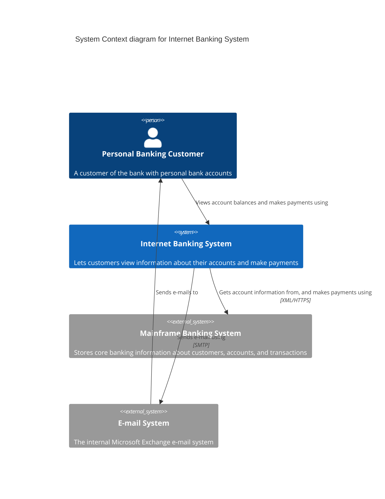
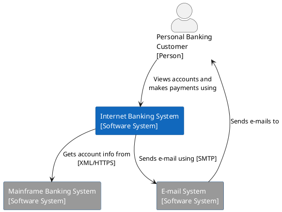
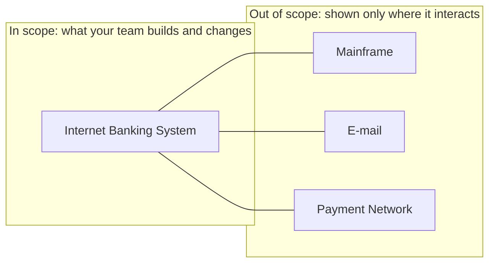
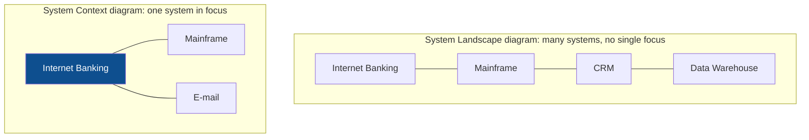

# Level 1 - System Context

A **System Context diagram** shows one software system as a single box, the people who use it, and the other systems it interacts with. Nothing inside the box is shown. It answers "what is this thing, who uses it, and what does it depend on?" and it is the only C4 diagram a non-technical audience should ever need.

### Elements allowed

| Element | Meaning | Usual shape |
| --- | --- | --- |
| Person | A human role, not a named individual | Box with a head on top, or a stick figure |
| Software System (in scope) | The system being described | Filled box, centre of the diagram |
| Software System (external) | Anything owned or run by someone else, or already existing | Greyed box |
| Relationship | An interaction, labelled with a verb phrase | Arrow |

Deliberately absent: technologies, protocols at the implementation level, deployment nodes, databases, and internal structure. If a box would disappear when the system is deleted, it belongs at level 2, not here.

### The example

Read it as sentences: *a personal banking customer views account balances using the internet banking system, which gets account information from the mainframe banking system.* If a box and arrow cannot be read as a sentence, the label is wrong.

### The same diagram in PlantUML

Either notation is fine; the discipline is in the content, not the tool.

### Choosing the system boundary

The boundary decides what the diagram is about, and it is the only genuinely hard decision at this level.

Rules of thumb:

- **Scope by ownership, not by technology.** If your team can change it and deploy it, it is inside.
- **One system per diagram.** A Context diagram covering "everything the company runs" is a landscape diagram, a different (and useful) artefact, not a C4 Context diagram.
- **External systems keep their real names.** "Stripe", "Salesforce", "the mainframe", not "third-party service".
- **Roles, not org charts.** Draw "Back Office Staff", not "Jane in Ops".

### System Landscape vs System Context

The landscape view is for enterprise-level conversations; the context view is for a single delivery team. Confusing them produces a diagram nobody can act on.

### Common mistakes

- Drawing containers (a database, a queue) at this level. Level 1 has no internals, ever.
- Modelling a person as a system: "Admin Tool user" is a person; "Admin Tool" is a container.
- Arrows without direction, or bidirectional arrows hiding who initiates the call. Draw the initiator as the source; add a second arrow for callbacks and webhooks.
- Omitting the ugly integrations. The batch file drop nobody wants to admit to is exactly what a newcomer needs to see.

### What it is good for

- Onboarding: a new joiner understands the landscape in one page.
- Scoping: the boundary makes explicit what the project does and does not include.
- Risk: every external arrow is a dependency, an SLA question, and a failure mode. Availability multiplies along those arrows, see [Availability](../Architectural%20Characteristics/Availability.md).

Next: [Level 2, Containers](Level%202%20-%20Containers.md).

## Check Your Understanding

<quiz>
Which element does **not** belong on a System Context diagram?

- [x] The PostgreSQL database used by the system
> Correct. A database is a container; level 1 shows no internals of the system in scope.
- [ ] A person representing the "personal banking customer" role
- [ ] An existing mainframe system the system integrates with
- [ ] A labelled arrow reading "Sends e-mail using [SMTP]"
</quiz>

<quiz>
What is the difference between a System Landscape diagram and a System Context diagram?

- [x] A landscape diagram shows many systems with no single focus; a context diagram puts exactly one system in scope and shows only what touches it
> Correct. Landscape serves enterprise-level conversations, context serves one delivery team.
- [ ] A landscape diagram is drawn before requirements, a context diagram after
- [ ] A landscape diagram is level 0 of C4 and required before level 1
- [ ] They are the same diagram with different colour schemes
</quiz>
