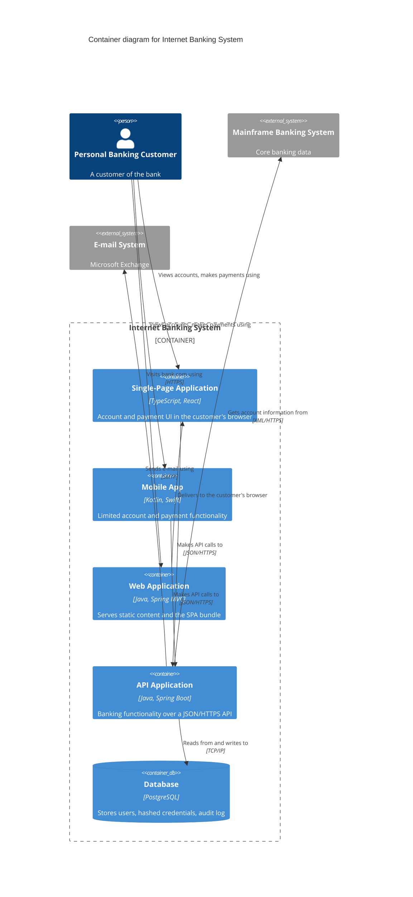
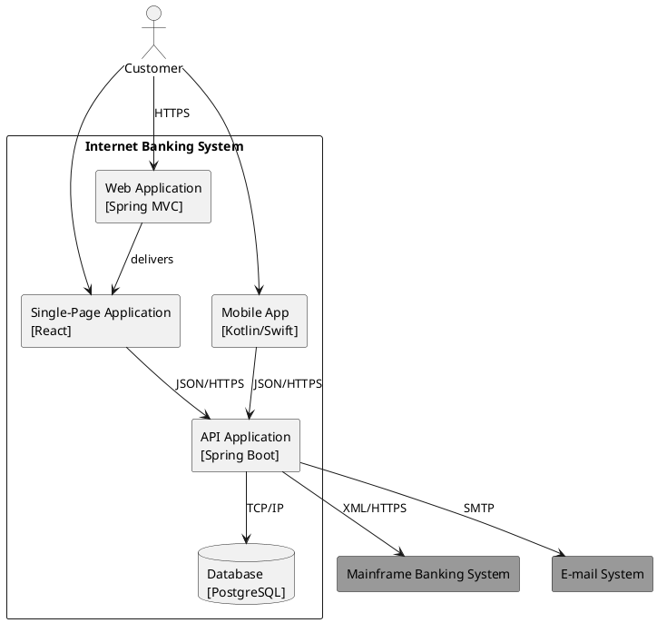
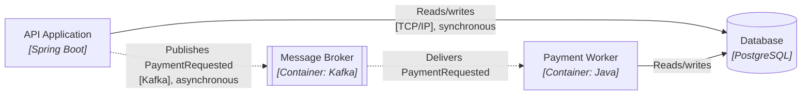
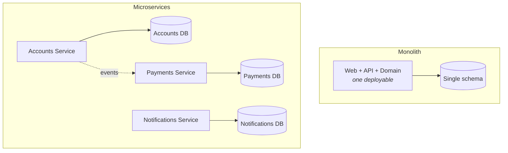
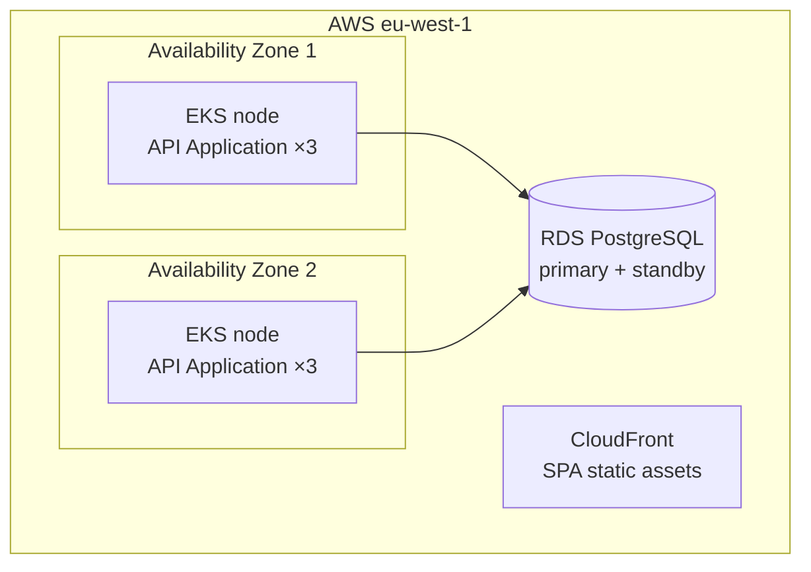

# Level 2 - Containers

A **Container diagram** zooms into the system box from level 1 and shows the separately runnable or deployable things inside it, the technology each one uses, and how they communicate. It is the most valuable C4 diagram: it is the first picture that shows shape, and it is stable enough to stay true for months.

### What counts as a container

A container is anything that hosts code or stores data and can be started and stopped on its own:

| Container kind | Examples |
| --- | --- |
| Server-side application | Spring Boot service, Django app, Rails app, Lambda function |
| Client-side application | Single-page application, mobile app, desktop app |
| Data store | Relational schema, document store, blob storage, cache |
| Infrastructure with your code or data in it | Message broker topic set, search index, file system |

Not containers: a library or JAR (that is code inside a container), a class, a Kubernetes namespace, a VM, an availability zone. Deployment topology is a *Deployment diagram*, a separate supplementary view.

### The example

Three things this diagram makes obvious that level 1 could not: the browser app talks to the API directly rather than through the web server; the database is reachable only from the API; and the mainframe integration has exactly one caller.

### The same view in PlantUML

### Synchronous and asynchronous edges look different

C4 has no required notation for this, so pick one and put it in the legend. Dashed arrows for asynchronous messaging is the common choice.

The distinction matters architecturally, not cosmetically: synchronous edges multiply failure probability and add latency, asynchronous edges buy availability at the price of eventual consistency. See [Event-Driven Architecture](../Architectural%20Patterns/EDA.md).

### Container diagrams expose the architectural style

The same system drawn at level 2 reveals immediately whether it is a monolith, a modular monolith, or microservices.

This is why the container diagram is the one to bring to a design review: the number of boxes is the deployment cost, the number of arrows is the coupling, and the number of data stores is the consistency story.

### How to keep it honest

- **One diagram per system, not per team.** If it does not fit on one page, the system is probably several systems.
- **Name the technology in every box.** "Service" tells the reader nothing; "Service [Go 1.22, gRPC]" tells them how to run it.
- **Draw the data stores.** Diagrams that hide databases hide the hardest coupling in the system.
- **Include the things you are ashamed of**: the cron box, the shared FTP directory, the legacy admin app.

### Deployment is a different diagram

A **Deployment diagram** maps containers onto infrastructure nodes. It is a supplementary C4 view, and it changes far more often than the container diagram, so keep them separate.

Next: [Level 3, Components](Level%203%20-%20Components.md).

## Check Your Understanding

<quiz>
Which of these is a C4 container?

- [x] A PostgreSQL schema that stores the system's data
> Correct. A data store is separately runnable and hosts the system's data, so it is a container.
- [ ] A shared validation library packaged as a JAR
- [ ] The `PaymentService` class
- [ ] The Kubernetes namespace the services are deployed into
</quiz>

<quiz>
Why is the container diagram usually the most useful C4 diagram?

- [x] It is the first view that shows deployable units, their technologies, and their communication paths, which is what design reviews argue about
> Correct. Box count is deployment cost, arrow count is coupling, and data stores expose the consistency story.
- [ ] It is the only level that permits labelled relationships
- [ ] It replaces the need for a system context diagram
- [ ] It shows how containers map onto servers and regions
</quiz>
