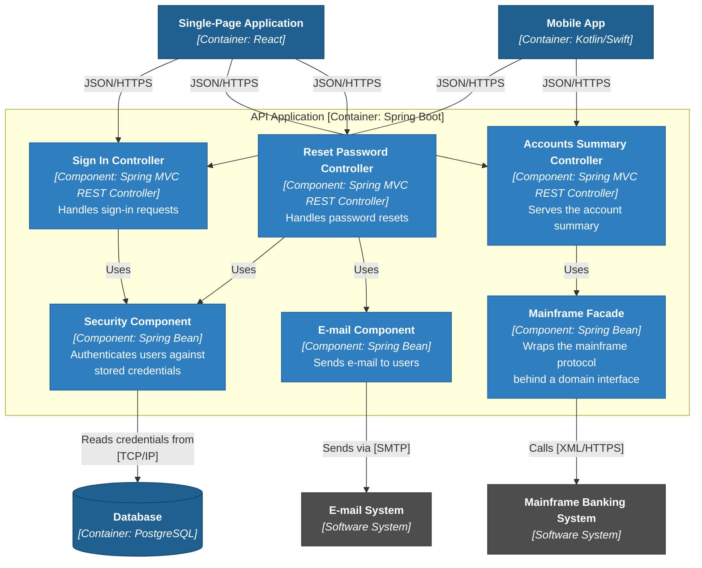
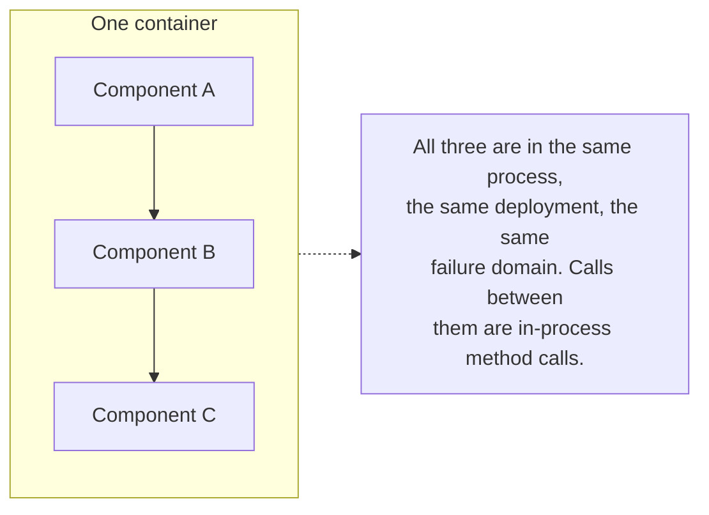
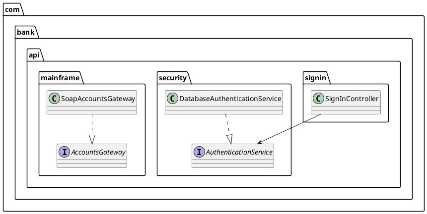
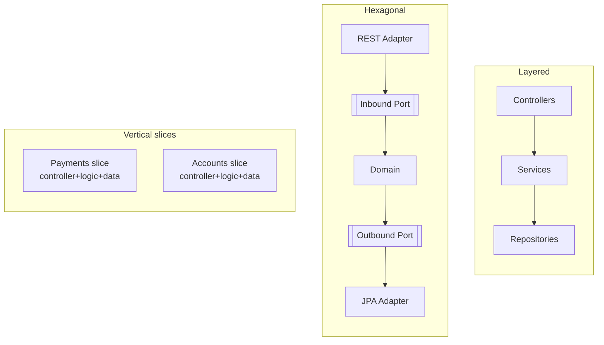

# Level 3 - Components

A **Component diagram** zooms into one container and shows the major building blocks inside it, their responsibilities, and how they collaborate. A component in C4 is a grouping of related code behind a well-defined interface, running inside a container; it is *not* separately deployable, which is exactly what separates level 3 from level 2.

Draw this diagram only for containers where the internal structure is non-obvious or contested. A CRUD service does not need one.

### The example: inside the API Application



What the diagram earns its keep for: it shows that every controller depends on the Security component, and that only one component knows the mainframe protocol. Both are architectural facts, and both are checkable.

### Components are logical, not physical



Because component boundaries are in-process, they cost nothing at runtime and everything in discipline: nothing at the compiler level stops `Sign In Controller` from reaching into the mainframe facade's internals. That is what makes component boundaries worth *testing*, not just drawing, see the fitness function below.

### Mapping components onto the code

The mapping should be mechanical, or the diagram will drift within weeks. Pick one convention per codebase:

| Convention | Component = | Enforcement |
| --- | --- | --- |
| Package by component | One top-level package | Import rules between packages |
| Module per component | A Gradle/Maven/Go module | Build-level dependency graph |
| Namespace convention | `Banking.Security.*` | Static-analysis rules |



If a diagram box has no corresponding package, module, or namespace, it is a wish rather than a component.

### Layered, hexagonal, and vertical-slice shapes at level 3

The component diagram is where architectural patterns become visible inside a single deployable.



See [Layered Architecture](../Architectural%20Patterns/Layered%20Architecture.md) and [Hexagonal Architecture](../Architectural%20Patterns/Hexagonal.md).

### Keeping level 3 alive

Component diagrams rot faster than any other level, because code changes daily. Two defences:

1. **Generate them.** Structurizr, jQAssistant, and similar tools read annotations or package structure and emit the diagram, so it cannot disagree with the code.
2. **Make the boundaries executable.** An ArchUnit-style test is a fitness function for level 3:

```java
@ArchTest
static final ArchRule only_the_facade_talks_to_the_mainframe =
    noClasses().that().resideOutsideOfPackage("..mainframe..")
        .should().dependOnClassesThat().resideInAPackage("..mainframe.soap..");
```

A drawn boundary with no test is a suggestion; a tested boundary is architecture. See [Modularity](../Architectural%20Characteristics/Modularity.md).

### Common mistakes

- **Drawing every class.** That is level 4, and usually nobody's job.
- **Components that mirror the layer cake only** (`Controller`, `Service`, `Repository`, three boxes for the whole container). True, and useless, it says nothing about *this* system.
- **Hiding cross-cutting components.** Logging, auth, and transaction management deserve a box if changing them means touching everything.
- **Component boundaries nobody can name in the code.** If two people disagree about which package a component maps to, the boundary is fictional.

Next: [Level 4, Code](Level%204%20-%20Code.md).

## Check Your Understanding

<quiz>
What separates a C4 component from a C4 container?

- [x] A component runs inside a container and is not separately deployable
> Correct. Components are in-process groupings of code behind an interface; containers are separately runnable or deployable units.
- [ ] A component is written in a single language, a container may mix several
- [ ] A component has an interface, a container does not
- [ ] A component is described by a class diagram, a container by a sequence diagram
</quiz>

<quiz>
Why do component diagrams go stale faster than container diagrams, and what is the standard defence?

- [x] Because they track code structure, which changes daily, so teams generate them from the code and enforce boundaries with architecture tests
> Correct. Generation keeps the picture true, and tests such as ArchUnit rules turn drawn boundaries into enforced ones.
- [ ] Because component names are not standardised, so they are renamed often
- [ ] Because they are drawn before implementation begins and never revisited
- [ ] Because deployment topology changes on every release
</quiz>
