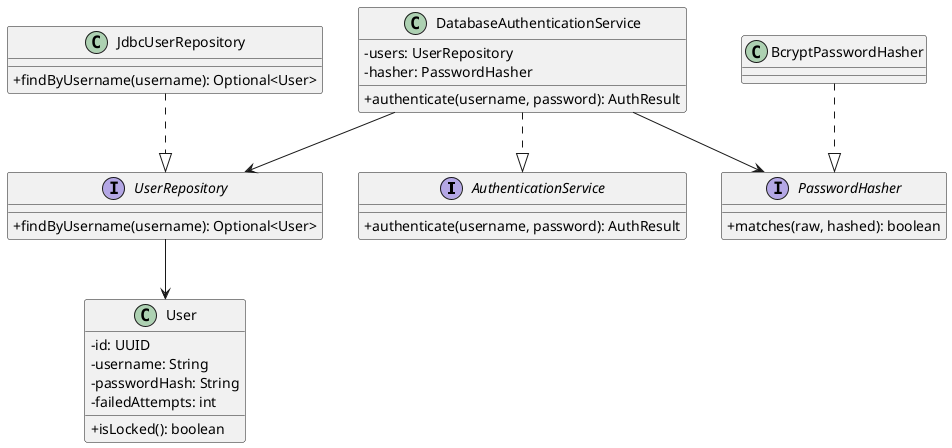
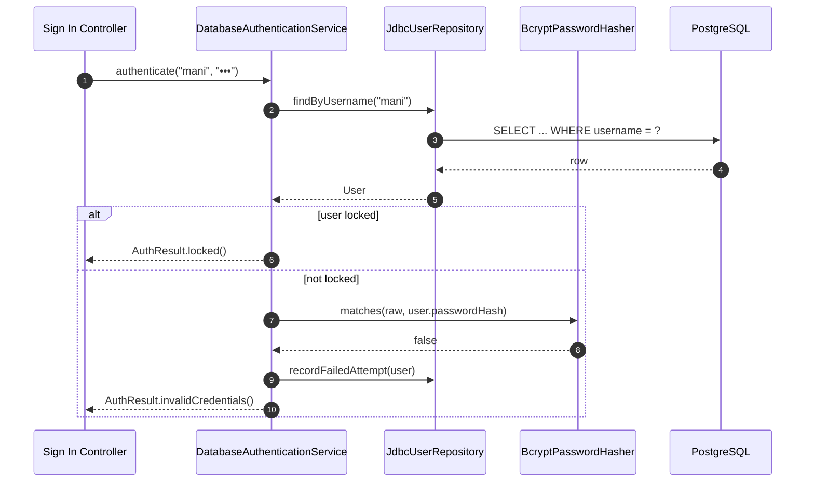
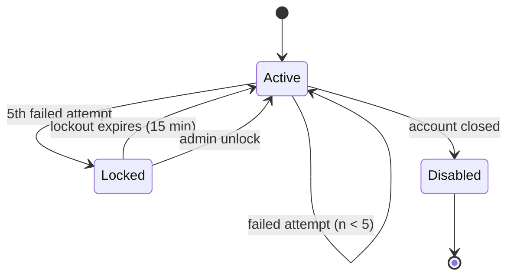
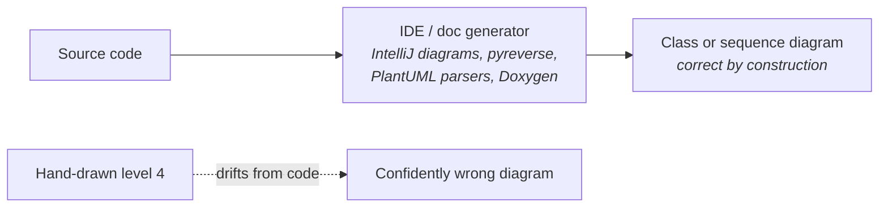
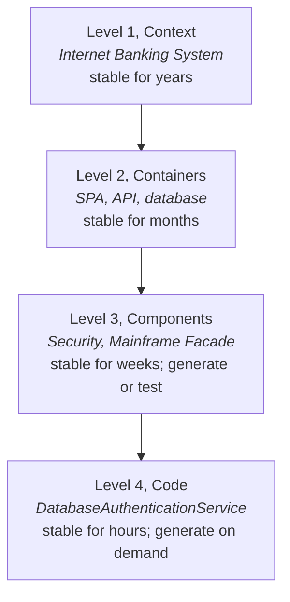

# Level 4 - Code

A **Code diagram** zooms into one component and shows how it is implemented: classes, interfaces, and their relationships, usually as a UML class or sequence diagram. It is the optional level. Simon Brown's own advice is to draw it rarely, keep it out of version-controlled documentation, and generate it from an IDE when needed, because it is obsolete the moment someone refactors.

Draw one when the design is subtle and worth explaining: a state machine, a strategy hierarchy, a tricky concurrency protocol.

### The example: inside the Security Component

Note the shape: the component exposes one interface to the rest of the container, and hides the rest. That is what makes it a component rather than a folder.

### Behaviour, not just structure

Class diagrams show what exists; sequence diagrams show what happens. For most level-4 explanations, the sequence is the interesting part.

The `alt` block carries the design decision worth documenting: lockout is checked before the hash comparison, so a locked account costs no bcrypt work. Structure alone would never have shown that.

### State, when the logic is a machine

### When to draw level 4, and when not to

| Situation | Draw it? |
| --- | --- |
| Explaining a non-obvious algorithm or protocol to reviewers | Yes, in the pull request or an ADR |
| Onboarding someone into a subtle component | Yes, generated on the spot |
| Documenting every component of the system | No. It will be wrong before the sprint ends |
| Whiteboarding a design before writing it | Yes, then erase it |
| Repository documentation intended to stay accurate | No. Generate on demand instead |

The rule of thumb: **level 4 diagrams should be cheap enough to throw away.** If keeping one accurate would cost real effort, the code should be readable enough not to need it.

### Generate rather than maintain

A hand-maintained level-4 diagram is worse than none: readers trust it, and it lies. This is the same failure mode as stale comments, at larger scale.

### How the four levels relate one last time

Effort should be spent in inverse proportion to volatility: invest in levels 1 and 2, enforce level 3 with tests, and let level 4 be disposable.

## Check Your Understanding

<quiz>
What is the standard advice about level 4 code diagrams?

- [x] Draw them rarely and generate them on demand, because they go stale immediately and a stale diagram misleads
> Correct. Level 4 is optional and disposable; effort belongs at the more stable levels.
- [ ] Draw one per class so the documentation is complete
- [ ] Draw them first, since code is the foundation the other levels rest on
- [ ] Never draw them, since UML is incompatible with C4
</quiz>

<quiz>
A sequence diagram of the sign-in flow shows the lockout check happening before the password hash comparison. Why is that worth documenting at level 4?

- [x] Because it is a behavioural design decision, a locked account avoids expensive hashing, that a class diagram cannot express
> Correct. Structure shows what exists; behaviour shows the ordering decisions that carry the reasoning.
- [ ] Because C4 requires a sequence diagram for every component
- [ ] Because it defines the container boundary
- [ ] Because sequence diagrams replace class diagrams at level 4
</quiz>
