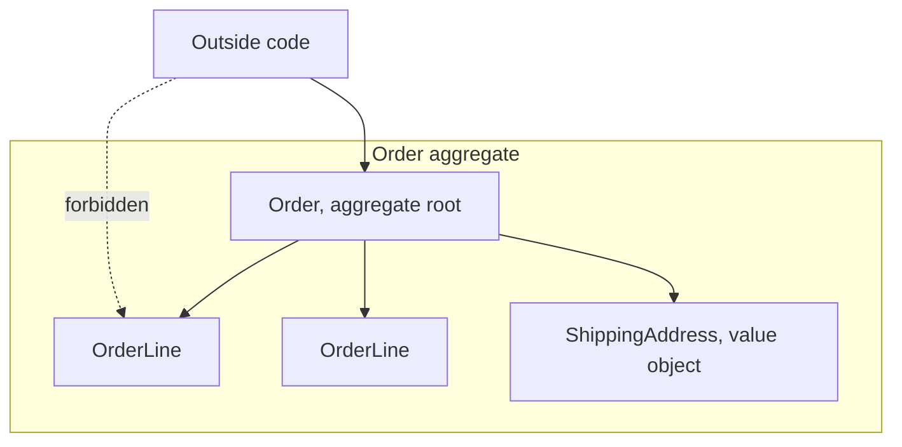
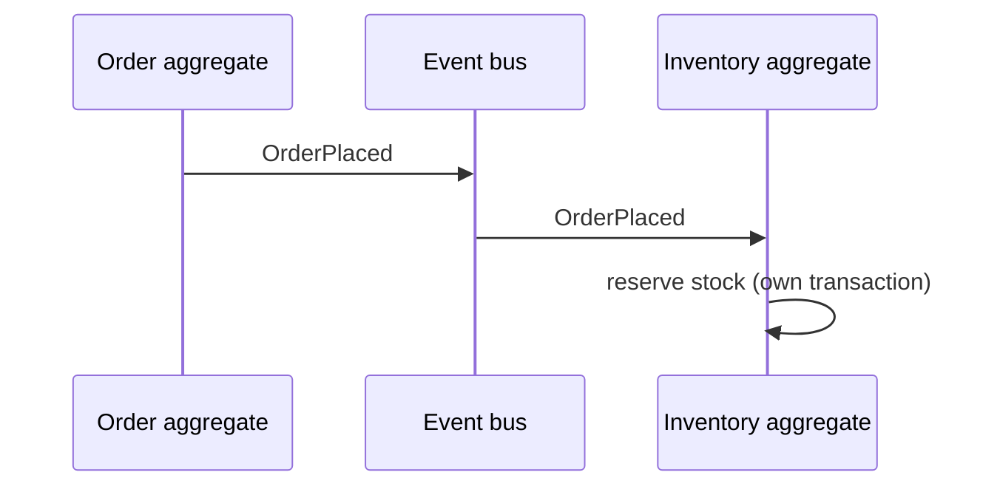

# Aggregates

An **aggregate** is a cluster of [entities](Entities.md) and
[value objects](Value%20Objects.md) treated as one unit for changes. One entity is the
**aggregate root**, and it is the only member outside code may reference.

An aggregate is not a "group of related things". It is a **consistency boundary**: the
set of objects that must change together, in one transaction, for the domain rules to
stay true.



## The four rules

1. **Reference the root only.** Outside code never holds an `OrderLine`. If it needs to
   change one, it asks the `Order`.
2. **One transaction, one aggregate.** Needing to change two atomically means either the
   boundary is wrong, or the second change should be eventually consistent through a
   [domain event](#domain-events).
3. **Reference other aggregates by identity.** `Order` holds a `customer_id`, never a
   `Customer` object.
4. **Invariants hold at the boundary.** Every rule spanning members is enforced by the
   root, and the aggregate is valid whenever a transaction commits.

```python
class Order:                                      # aggregate root
    def add_line(self, sku: Sku, qty: int, price: Money) -> None:
        if self.status is not Status.DRAFT:
            raise OrderAlreadyPlaced(self.id)     # rule 4
        if self.total() + price * qty > self.credit_limit:
            raise CreditLimitExceeded(self.id)
        self._lines.append(OrderLine(sku, qty, price))

    def lines(self) -> tuple[OrderLine, ...]:
        return tuple(self._lines)                 # rule 1: no mutable handle escapes
```

Returning the internal list directly would hand a caller the ability to bypass every
check above, which is the most common way rule 1 is broken by accident.

## Finding the boundary

Ask, for each pair of objects: **if these two are briefly out of step, is the business
broken?**

- *An order and its lines* — yes, a total computed from half-saved lines is wrong. One
  aggregate.
- *An order and the customer's loyalty points* — no, awarding points a second later is
  fine. Two aggregates, linked by an event.

That question, asked out loud with a domain expert, decides more than any diagram.

## Keep them small

The classic beginner error is a `Customer` aggregate owning every order, invoice and
ticket.

| Symptom | Cause |
|---|---|
| Loading one customer pulls thousands of rows | Aggregate too large |
| Two users editing unrelated orders collide | Lock contention on a shared root |
| Every transaction touches the same row | The whole system funnels through one aggregate |

Prefer many small aggregates linked by identity. A useful default is a root plus the
handful of objects that genuinely cannot be stale relative to it, and single-entity
aggregates are common and fine.

## Concurrency

Because the aggregate is the transaction boundary, it is also the locking unit.
Optimistic concurrency with a version number on the root is the standard approach: load
at version 7, save with `WHERE version = 7`, and if zero rows update, someone else won
and the operation retries. Small aggregates make those collisions rare.

## Domain events

When two aggregates must react to each other, the second change happens afterwards, in
its own transaction.



Events are immutable facts named in the past tense: `OrderPlaced`, `PaymentFailed`. The
trade is deliberate: the two aggregates become **eventually consistent**, which is the
price of keeping each transaction to one aggregate. This is also the seam to
[event-driven architecture](../Architectural%20Patterns/EDA.md) and to CQRS, where reads
are served by a separate model.

If eventual consistency is genuinely unacceptable for a rule, that rule is telling you
the two things belong in one aggregate after all.

## Aggregates and services

An aggregate is loaded and saved as a whole through a [repository](Repositories.md), one
repository per root. Logic spanning several aggregates goes in a
[domain service](Domain%20Services.md), not into one of the roots.

## Check Your Understanding

<quiz>
What defines an aggregate boundary?

- [ ] The tables the objects are stored in
- [x] The consistency boundary: the objects that must change together in one transaction for the domain invariants to hold
> Correct. Which is why one transaction should modify exactly one aggregate.
- [ ] The classes owned by one team
- [ ] The objects displayed together on one screen
</quiz>

<quiz>
`Order` needs to reference the customer. What should it hold?

- [ ] The full `Customer` object, so navigation is convenient
- [x] The `customer_id`, because other aggregates are referenced by identity
> Correct. A direct reference pulls a second aggregate into the transaction and blurs the boundary.
- [ ] A copy of the customer's fields, synchronised by a trigger
- [ ] Nothing, since the repository can infer it
</quiz>

<quiz>
A `Customer` aggregate owns every order and invoice for that customer. What goes wrong?

- [ ] Nothing, this correctly models the relationship
- [x] Loading or locking the customer pulls in and blocks everything else, so unrelated edits collide and the root becomes a contention point
> Correct. Prefer many small aggregates referencing each other by identity.
- [ ] The database cannot express the relationship
- [ ] Invariants can no longer be enforced anywhere
</quiz>
