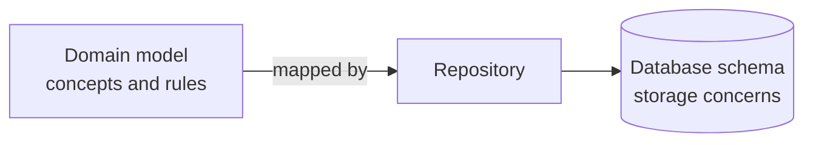

# Domain Model

A **domain model** is an object model of the business: the concepts, their rules and
their behaviour, expressed in the
[ubiquitous language](Ubiquitous%20Language.md) and free of any technology concern. It
is not the database schema, and it is not a set of data transfer objects.

The point of a model is that it is *selective*. It captures the parts of reality the
software must reason about and deliberately ignores the rest. A shipping model knows a
parcel has weight and a destination; it does not know its colour.

## Behaviour lives with data

The defining property of a rich model is that the object that owns the data also
enforces the rules about it.

```python
class Subscription:
    def cancel(self, on: date) -> None:
        if self.status is not Status.ACTIVE:
            raise NotActive(self.id)
        if on < self.started_on:
            raise CancelBeforeStart(self.id)
        self.status = Status.CANCELLED
        self.cancelled_on = on
```

Every caller gets the rules for free. There is exactly one place to read them, and one
place to change them.

## The anemic domain model

The most common failure is the opposite: objects holding only getters and setters, with
all behaviour pushed into service classes.

```python
# Anemic: the object cannot protect itself
class Subscription:
    status: Status
    started_on: date
    cancelled_on: date | None

class SubscriptionService:
    def cancel(self, sub: Subscription, on: date) -> None:
        if sub.status is not Status.ACTIVE:
            raise NotActive(sub.id)
        sub.status = Status.CANCELLED
        sub.cancelled_on = on
```

Nothing stops the next developer from writing `sub.status = Status.CANCELLED` directly
and skipping the check. Within a year the same rule exists in four services, in three
slightly different versions, and the code no longer tells you what the business does.

| | Rich model | Anemic model |
|---|---|---|
| Rules live in | The object that owns the data | Scattered service classes |
| Invalid states | Unreachable, the object refuses | Reachable by any setter |
| Reading the rules | One class | Grep across services |
| Fits | Complicated domains | Simple CRUD, where it is honest and fine |

Anemic is not always wrong. For a CRUD screen over a fixed schema, it is the simpler and
correct choice. It is wrong when the domain is the reason the project is hard, because
then it pays DDD's structural cost while dropping its benefit.

## Make invalid states unrepresentable

The strongest models push validity into types, so wrong states cannot be constructed at
all.

- A [value object](Value%20Objects.md) `EmailAddress` that validates in its constructor
  means no function downstream needs to re-check.
- A `DateRange` that rejects `end < start` removes an entire class of assertions.
- Separate types for `DraftOrder` and `PlacedOrder` mean "cannot add lines after
  placing" is a compile-time fact rather than a runtime check.

## The model is not the schema



They differ on purpose. The database normalises for storage and query; the model
organises for rules. A model shaped by the schema inherits foreign keys as object
references and ends up with a fully connected graph and no
[aggregate](Aggregates.md) boundaries.

## Models evolve

A domain model is never finished. Each new insight from a domain expert is a refactor,
and DDD calls the significant ones **breakthroughs**: a rename or reshaping that
suddenly makes several awkward rules simple. Expect the model to change more often than
the database.

## Check Your Understanding

<quiz>
What makes a domain model "anemic"?

- [ ] It has too few classes
- [x] Its objects hold data but no behaviour, with the business rules pushed out into service classes
> Correct. The rules then get duplicated and no object can protect its own invariants.
- [ ] It does not use inheritance
- [ ] It is not persisted to a database
</quiz>

<quiz>
Why should the domain model not simply mirror the database schema?

- [ ] Because object-relational mappers forbid it
- [x] Because the schema is organised for storage and querying, while the model is organised around rules, and copying the schema drags foreign keys in as object references with no aggregate boundaries
> Correct. The repository exists precisely to absorb that mismatch.
- [ ] Because schemas change more often than models
- [ ] Because normalisation is incompatible with object orientation
</quiz>

<quiz>
A `DateRange` value object rejects an end date earlier than its start date in its constructor. What has that bought?

- [ ] Faster serialization
- [x] Every downstream function can assume the range is valid, so an entire class of checks and invalid states disappears
> Correct. Making invalid states unrepresentable removes defensive code rather than adding it.
- [ ] Compatibility with the database schema
- [ ] Nothing, since the check could also live in a service
</quiz>
