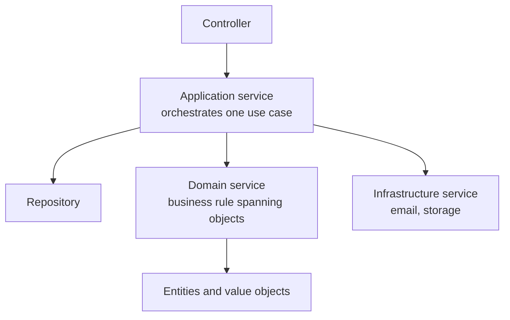

# Domain Services

A **domain service** holds domain logic that genuinely belongs to no single
[entity](Entities.md) or [value object](Value%20Objects.md). It is stateless, named in
the [ubiquitous language](Ubiquitous%20Language.md), and it lives in the domain layer.

The test for one: forcing the operation onto either participant would be a lie. A
transfer between two accounts is not something the source account does *to* the target.

```python
class TransferService:                       # domain service
    def transfer(self, source: Account, target: Account, amount: Money) -> None:
        if not source.can_withdraw(amount):
            raise InsufficientFunds(source.id)
        source.withdraw(amount)
        target.deposit(amount)
```

Note that the rules still live on `Account`. The service coordinates; it does not
reimplement.

## Three kinds of service

Confusing these is the usual source of mess.

| Layer | Knows about | Example | Contains business rules |
|---|---|---|---|
| **Application service** | Use cases, transactions, [repositories](Repositories.md) | `PlaceOrderHandler`: load, call, save, commit | No |
| **Domain service** | Domain concepts only | `TransferService`, `PricingPolicy` | Yes |
| **Infrastructure service** | Technology | `SmtpMailer`, `S3FileStore` | No |



An application service that contains an `if` about business rules has stolen work from
the domain. A domain service that opens a transaction or sends an email has stolen work
from the other two layers.

## When a domain service is right

- **The operation spans several aggregates**, such as transferring money or checking a
  booking against every other booking for a room.
- **The rule is a policy that varies**, such as pricing, discounting or risk scoring,
  where a `PricingPolicy` interface with several implementations is honest.
- **It needs external domain knowledge**, such as an exchange rate. The service takes an
  interface declared in the domain, and infrastructure implements it.

```python
class BookingService:
    def book(self, room: Room, period: DateRange, existing: list[Booking]) -> Booking:
        if any(b.period.overlaps(period) for b in existing):
            raise RoomUnavailable(room.id)
        return Booking.create(room.id, period)
```

## When it is wrong

The dominant failure is using services as the default home for all behaviour, which
produces an [anemic domain model](Domain%20Model.md): entities with getters and setters,
and every rule scattered across service classes.

Before writing a service, check in order:

1. Does this rule concern one object's own data? Put it on that
   [entity](Entities.md) or [value object](Value%20Objects.md).
2. Does it concern an aggregate's members? Put it on the
   [aggregate root](Aggregates.md).
3. Is it only orchestration, loading and saving? That is an application service.
4. Only what survives all three is a domain service.

Other signs it has gone wrong:

- **`*Manager`, `*Helper`, `*Util`.** Names outside the ubiquitous language, and usually
  a bag of unrelated functions.
- **Stateful services.** State belongs in the model. A service holding fields between
  calls is an entity in disguise.
- **A service per entity.** `OrderService`, `CustomerService`, `InvoiceService` matching
  the entities one for one is the anemic pattern with extra steps.

## Keep them small and named honestly

A good domain service is one operation with a name a domain expert would recognise:
`TransferService`, `OverbookingPolicy`, `CreditRiskAssessment`. If the name needs "and"
to describe it, split it.

## Check Your Understanding

<quiz>
Transferring money between two accounts is implemented as a domain service. Why not put it on `Account`?

- [ ] Because entities cannot call methods on other entities
- [x] Because the operation belongs to neither account, so forcing it onto one would misrepresent the domain
> Correct. The service coordinates while the balance rules stay on `Account`.
- [ ] Because it needs a database transaction
- [ ] Because domain services are faster
</quiz>

<quiz>
What separates an application service from a domain service?

- [ ] Application services are stateless, domain services are not
- [x] The application service orchestrates a use case, loading, saving and committing, and holds no business rules, while the domain service holds rules and knows nothing about transactions or storage
> Correct. Business logic in the application layer, or transactions in the domain layer, are both leaks.
- [ ] They are the same thing, named differently by convention
- [ ] Application services live in the domain layer
</quiz>

<quiz>
A codebase has `OrderService`, `CustomerService` and `InvoiceService`, one per entity, holding all the rules. What is this?

- [ ] Correct DDD, since each service owns its aggregate
- [x] An anemic domain model: services used as the default home for behaviour that belongs on the entities themselves
> Correct. Domain services are for logic that fits no single object, not a parallel class for every one of them.
- [ ] A repository layer
- [ ] A context map
</quiz>
