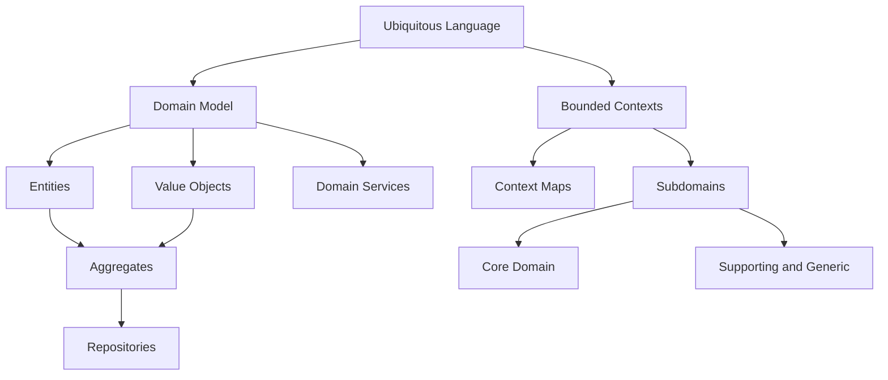
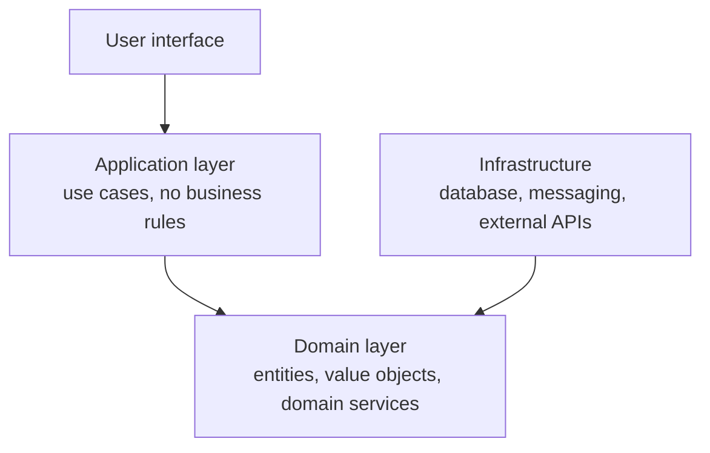

# Domain-Driven Design (DDD)

**Domain-Driven Design**, named by Eric Evans in 2003, is the argument that the hard
part of most business software is not the technology but the domain, and that the
codebase should therefore be organised around the domain rather than around technical
layers.

Everything in this section hangs off two commitments:

1. **[Ubiquitous language](Ubiquitous%20Language.md).** One vocabulary, used identically
   by domain experts, in conversation, and in the code.
2. **[Bounded contexts](Strategic%20DDD/Bounded%20Contexts.md).** That language is only
   consistent inside a boundary, so the system is split into contexts that each own
   their own model.

## The two halves

| | [Strategic DDD](Strategic%20DDD/index.md) | Tactical DDD |
|---|---|---|
| Question | Where do the boundaries go, and what deserves effort? | How is one model built inside a boundary? |
| Concepts | Bounded contexts, context maps, subdomains | Entities, value objects, aggregates, repositories, services |
| Cost of getting it wrong | The system fights you for years | Refactorable in weeks |

Strategic comes first. Perfect aggregates inside the wrong boundary buy nothing.

## Map of this section

**Tactical building blocks**

- [Domain Model](Domain%20Model.md), what a model is, and why an anemic one fails.
- [Entities](Entities.md), identity that survives change.
- [Value Objects](Value%20Objects.md), the cheapest, highest-value pattern here.
- [Aggregates](Aggregates.md), the consistency boundary.
- [Repositories](Repositories.md), collection-like access to aggregate roots.
- [Domain Services](Domain%20Services.md), logic that belongs to no single object.

**Strategic design**

- [Strategic DDD](Strategic%20DDD/index.md), the overview.
- [Bounded Contexts](Strategic%20DDD/Bounded%20Contexts.md).
- [Context Maps](Strategic%20DDD/Context%20Maps.md).
- [Subdomains](Strategic%20DDD/Subdomains.md), and where to spend effort:
  [Core Domain](Strategic%20DDD/Core%20Domain.md),
  [Supporting and Generic Domains](Strategic%20DDD/Supporting%20and%20Generic%20Domains.md).

## Layering

DDD is usually implemented with the domain at the centre and infrastructure at the
edges, which is exactly the arrangement that
[Clean](../Architectural%20Patterns/Clean%20Architecture.md) and
[Hexagonal](../Architectural%20Patterns/Hexagonal.md) architecture prescribe.

Note the arrow on infrastructure: it points *inward*. The domain declares the interface,
and infrastructure implements it.

## When DDD is worth it

- The domain is genuinely complicated, with rules experts argue about.
- The system will live for years and be changed by people who did not write it.
- Domain experts are available to talk to. Without them there is no ubiquitous language,
  only guesses in fancy packaging.

It is a bad trade for CRUD applications, short-lived projects, and anything that is
mostly data entry over a fixed schema. A straightforward
[layered](../Architectural%20Patterns/Layered%20Architecture.md) design will beat it
there.

## Check Your Understanding

<quiz>
Why does strategic design come before tactical patterns?

- [ ] Because strategic patterns are simpler to learn
- [x] Because boundaries are expensive to change later, while the building blocks inside one boundary can be refactored cheaply
> Correct. Correct aggregates inside a wrong bounded context still leave a system that resists change.
- [ ] Because tactical patterns require a microservice deployment
- [ ] They are independent, and the order does not matter
</quiz>

<quiz>
In DDD layering, which way does the dependency between the domain layer and infrastructure point?

- [ ] Domain depends on infrastructure, since it needs persistence
- [x] Infrastructure depends on the domain, because the domain declares the interfaces and infrastructure implements them
> Correct. That inversion is what keeps the domain testable and free of database concerns.
- [ ] They depend on each other equally
- [ ] Neither, they communicate only through the user interface
</quiz>
