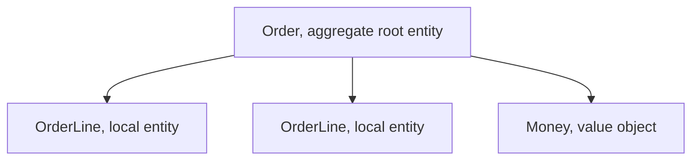

# Entities

An **entity** is a domain object defined by **identity** rather than by its attributes.
A user who changes name, email, address and password is still the same user. Two
customers with identical details are still two customers.

If you find yourself asking "is this the same one, or just an equal one?", you have an
entity.

## Identity, not equality

```python
class User:
    def __init__(self, user_id: UserId, email: EmailAddress):
        self.id = user_id
        self.email = email

    def __eq__(self, other) -> bool:
        return isinstance(other, User) and self.id == other.id

    def __hash__(self) -> int:
        return hash(self.id)
```

Equality compares the identifier and nothing else. Comparing all fields would say a user
is "different" after an email change, which is exactly backwards.

Contrast with a [value object](Value%20Objects.md), which has no identifier and is equal
by its contents.

| | Entity | Value object |
|---|---|---|
| Equality | By identifier | By all fields |
| Mutability | Changes over time | Immutable, replaced not modified |
| Question it answers | *Which* one is it? | *What* is it? |
| Example | `Order`, `User`, `Shipment` | `Money`, `DateRange`, `Address` |

## Where identifiers come from

| Source | Trade-off |
|---|---|
| Database sequence | Simple, but the object has no identity until saved, which breaks in-memory logic and tests |
| UUID generated in the domain | Identity exists from construction, works offline and across services. The usual DDD default |
| Natural key, such as an ISBN | Free, but only if the business truly guarantees it is unique and never changes. It rarely does |

Prefer generating the identifier in the domain, and wrap it in its own type:

```python
@dataclass(frozen=True)
class OrderId:
    value: UUID
```

A typed `OrderId` makes `cancel(customer_id)` a compile-time or type-check error instead
of a production incident. Bare `UUID` or `str` identifiers are interchangeable in every
signature they appear in, which is the bug.

## Entities own their rules

An entity is not a data holder. It enforces the invariants that concern only itself, and
it exposes intention-revealing methods rather than setters.

```python
class Shipment:
    def dispatch(self, at: datetime) -> None:
        if not self._lines:
            raise NothingToShip(self.id)
        if self.status is not Status.PACKED:
            raise NotPacked(self.id)
        self.status = Status.IN_TRANSIT
        self.dispatched_at = at
```

`dispatch()` says what the business does. `setStatus(2)` says nothing and enforces
nothing, which is how a model becomes [anemic](Domain%20Model.md).

## Entities inside aggregates

Most entities are not independently accessible. They live inside an
[aggregate](Aggregates.md) and are reached only through its root: an `OrderLine` is an
entity, uniquely identified within its `Order`, but no outside code should hold a
reference to one.



Local identity is enough for those: an `OrderLine` needs to be distinguishable from its
siblings, not globally unique.

## Common mistakes

- **Making everything an entity.** An identifier on `Address` invites two addresses with
  the same street to be treated as different things, and adds a table nobody needed.
  Most "small" concepts are value objects.
- **Equality on all fields.** Breaks the moment an attribute changes.
- **Mutable identifiers.** If the identifier can change, it is an attribute, not an
  identity.
- **Setters for everything.** The rules leak out to the callers.

## Check Your Understanding

<quiz>
What distinguishes an entity from a value object?

- [ ] Entities are stored in a database and value objects are not
- [x] An entity has an identity that persists through attribute changes, while a value object is equal by its contents
> Correct. The question "which one is it?" implies an entity, and "what is it?" implies a value object.
- [ ] Entities are immutable and value objects are mutable
- [ ] Entities belong to the infrastructure layer
</quiz>

<quiz>
Why wrap an identifier in a type such as `OrderId` instead of using a bare `UUID`?

- [ ] To make serialization faster
- [x] Because bare identifiers are interchangeable in every signature, so passing a customer identifier where an order identifier belongs compiles happily and fails in production
> Correct. A typed identifier turns that into an error caught before it ships.
- [ ] Because databases cannot store raw UUIDs
- [ ] To allow the identifier to be changed later
</quiz>

<quiz>
Where should an entity's identifier usually be generated?

- [ ] By the database, on insert
- [x] In the domain, typically as a UUID, so the object has identity from the moment it is constructed
> Correct. Database-generated identifiers leave objects without identity until saved, which complicates in-memory logic, tests and cross-service work.
- [ ] By the user interface layer
- [ ] From a natural key, since it is always free and stable
</quiz>
