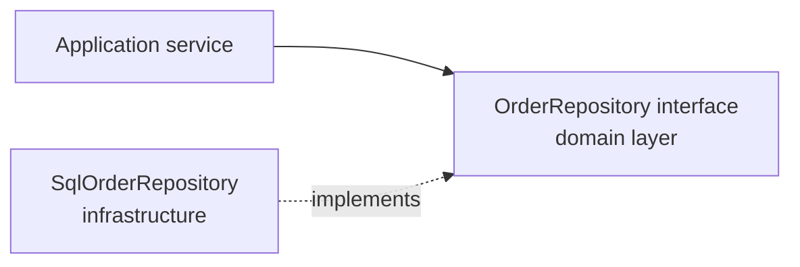

# Repositories

A **repository** gives collection-like access to [aggregate](Aggregates.md) roots, and
hides persistence completely. To the domain it looks like an in-memory set of objects
that happens to survive a restart.

**One repository per aggregate root**, not one per table and not one per entity. If
`OrderLine` has a repository, rule 1 of aggregates has already been broken.

## The interface belongs to the domain

The repository is *declared* in the domain layer and *implemented* in infrastructure, so
the dependency points inward.

```python
# domain layer: no SQL, no ORM, no imports from infrastructure
class OrderRepository(Protocol):
    def get(self, order_id: OrderId) -> Order: ...
    def save(self, order: Order) -> None: ...
    def of_customer(self, customer_id: CustomerId) -> list[Order]: ...
```

```python
# infrastructure layer
class SqlOrderRepository:
    def get(self, order_id: OrderId) -> Order:
        row = self._db.fetch_order(order_id.value)
        if row is None:
            raise OrderNotFound(order_id)
        return _to_domain(row)
```



This is the same dependency inversion that
[Hexagonal](../Architectural%20Patterns/Hexagonal.md) architecture calls a port and an
adapter. Its practical payoff is that domain tests run against an in-memory
implementation with no database at all.

## Whole aggregates, in and out

A repository returns a fully constructed aggregate, valid and ready to use, and saves it
as a unit. It never returns half of one, and never returns rows, dictionaries or query
builders. A repository that exposes `find(sql_fragment)` is a data access object wearing
the name, and it lets persistence concerns spread back into the domain.

Query methods are named in the domain language and return domain objects:

```python
def overdue_on(self, day: date) -> list[Invoice]: ...   # good
def find_by_status_and_date(self, status: int, d): ...  # leaking the schema
```

## Repository or DAO

| | Repository | Data access object |
|---|---|---|
| Granularity | One per aggregate root | Often one per table |
| Returns | Aggregates, valid and whole | Rows, records, DTOs |
| Vocabulary | Domain language | Table and column names |
| Declared in | Domain layer | Infrastructure |

Both are legitimate. Only one of them is part of a domain model.

## Reads that do not fit

Reporting screens, list views and dashboards frequently need data spanning several
aggregates. Loading twenty aggregates to render a table is slow and pointless: those
reads enforce no invariants.

Do not distort the aggregates to serve them. Use a separate read model, meaning a direct
query returning a purpose-built view object, alongside the repositories used for
writes. That split is the core idea of CQRS, and adopting it for a handful of screens
does not require adopting the whole pattern.

## Transactions

The repository saves an aggregate; deciding *when* to commit is the application layer's
job, usually through a unit of work that wraps one use case in one transaction. Keeping
that decision out of the repository is what stops a use case from accidentally
committing five times.

## Testing

```python
class InMemoryOrderRepository:
    def __init__(self):
        self._orders: dict[OrderId, Order] = {}

    def get(self, order_id): return self._orders[order_id]
    def save(self, order): self._orders[order.id] = order
```

Ten lines, and the whole domain test suite runs in milliseconds. Getting this for free
is a large part of why the interface lives in the domain layer.

## Check Your Understanding

<quiz>
Why is the repository interface declared in the domain layer rather than in infrastructure?

- [ ] To keep all interfaces in one folder
- [x] So the dependency points inward: the domain declares what it needs and infrastructure implements it, leaving the domain free of persistence concerns and testable without a database
> Correct. It is the ports-and-adapters inversion applied to storage.
- [ ] Because ORMs require it
- [ ] So that the database schema can be generated from the interface
</quiz>

<quiz>
How many repositories should an `Order` aggregate containing `OrderLine` entities have?

- [ ] Two, one per entity
- [x] One, for the aggregate root, because lines are only reachable through the order
> Correct. A repository for a non-root entity means outside code holds references it should not have.
- [ ] One per database table involved
- [ ] None, aggregates persist themselves
</quiz>

<quiz>
A dashboard needs a table joining data from five aggregates. What is the right move?

- [ ] Merge the five aggregates so one repository can return everything
- [ ] Add a `findAll` method returning raw rows to each repository
- [x] Use a separate read model with a purpose-built query, leaving the write-side aggregates unchanged
> Correct. Read screens enforce no invariants, so they should not dictate the shape of the consistency boundaries.
- [ ] Load all five aggregates and join them in memory on every request
</quiz>
