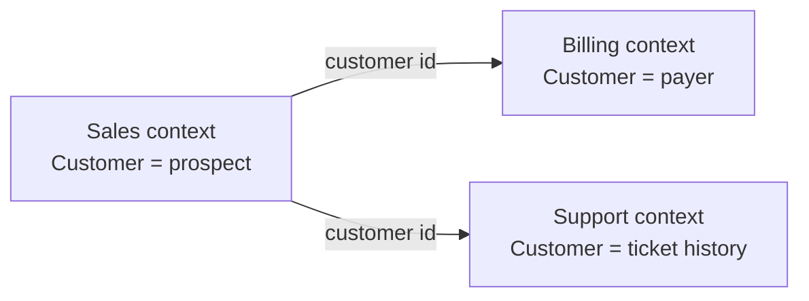

# Bounded Contexts

A **bounded context** is an explicit boundary inside which one model and one
[ubiquitous language](../Ubiquitous%20Language.md) apply. Inside it, every term has
exactly one meaning. Outside it, the same word may mean something else, and that is
allowed.

This is the single most important idea in [DDD](../index.md). Without it, the ubiquitous
language cannot survive contact with a system of any size, because the whole company
does not agree on what words mean.

## The same word, three meanings

| Context | What a customer is | Fields that matter |
|---|---|---|
| **Sales** | A prospect with a pipeline stage | Lead source, owner, expected value |
| **Billing** | A legal payer | Tax identity, billing address, payment method |
| **Support** | A person with a ticket history | Entitlement, timezone, contact preference |

One shared `Customer` class grows every field any context ever needed, and every change
risks all three. Three models linked by a shared identifier stay small, and each changes
alone.

The identifier is the only thing that crosses. Everything else is translated at the
border by a [context map](Context%20Maps.md) relationship.

## Recognising a boundary

Listen for these, all of which are the same signal:

- **The same term is defined differently** by two groups of people.
- **Different terms mean the same thing**, such as *shipment* and *consignment*.
- **A class has optional fields used by only one caller group**, which is one model
  hosting two.
- **A change requested by one department keeps breaking another's screens.**
- **An entity has status fields that only some states use**, such as an `Order` carrying
  both warehouse and finance states.

## Defining one

A bounded context needs three things stated explicitly, and the third is the one usually
skipped:

1. **Its model and language**, meaning the terms and their meanings inside.
2. **Its boundary in code**, so a module, a package or a service, with no shared domain
   classes crossing it.
3. **Its owning team.** A context maintained by three teams drifts into three models
   sharing a schema.

Enforce the boundary mechanically where you can: separate modules with no imports of
each other's domain classes, separate schemas, separate deployables. A boundary that
exists only in a diagram is not a boundary.

## Contexts and microservices

Bounded contexts are the most defensible way to draw
[microservice](../../Architectural%20Patterns/Microservice%20Architecture.md)
boundaries, because they align with how the business changes rather than with technical
layers or table structure. Services split by layer, or one per database table, require
coordinated releases for every feature.

The relationship is one way, though. Every good service boundary is a context boundary,
but a context does not have to be a service: modules inside one deployable are a
perfectly good implementation, and a much cheaper place to start. Get the boundaries
right in a monolith, then extract if you actually need independent deployment.

## Shared databases break contexts

Two contexts reading and writing the same tables are one context with two codebases. The
schema becomes the shared model, nobody can change a column, and the boundary exists
only as an intention. Each context owns its own storage, and integration happens through
APIs or events.

## When contexts are too small

The failure runs both ways. Splitting into a dozen tiny contexts means every feature
touches five of them, and the translation and coordination cost exceeds anything the
boundaries bought. If two contexts always change together, they were one context.

## Check Your Understanding

<quiz>
Why does DDD refuse to build one enterprise-wide model of "Customer"?

- [ ] Because large classes are slow at runtime
- [x] Because the term means different things in different contexts, so a shared model accumulates every field and couples unrelated changes together
> Correct. Separate models linked by identity let each part change on its own schedule.
- [ ] Because object-oriented languages cannot express it
- [ ] Because the database cannot hold that many columns
</quiz>

<quiz>
Two services read and write the same database tables. What does that mean for their bounded contexts?

- [ ] They are two contexts sharing infrastructure, which is fine
- [x] They are effectively one context with two codebases, because the schema has become the shared model and neither can change it alone
> Correct. Context boundaries require owned storage, with integration through APIs or events.
- [ ] The boundary is valid as long as each service uses different tables in that database
- [ ] Nothing, since bounded contexts are only about naming
</quiz>

<quiz>
Must every bounded context be a separate microservice?

- [ ] Yes, otherwise the boundary is not real
- [x] No. Modules within one deployable can enforce a context boundary, and that is a cheaper place to start
> Correct. Good service boundaries follow context boundaries, but contexts do not require independent deployment to be useful.
- [ ] Only if the contexts are owned by different teams
- [ ] Only when the contexts share a database
</quiz>
