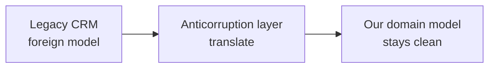
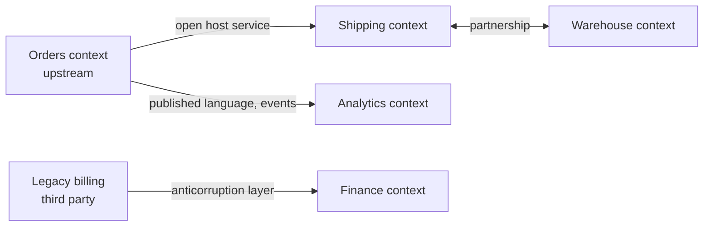

# Context Maps

A **context map** records how [bounded contexts](Bounded%20Contexts.md) relate: which
model each one uses, which direction the influence flows, and what the *political*
relationship between the owning teams is. That last part is what distinguishes it from
an integration diagram.

The map describes reality, not the intended architecture. Drawing the system as you wish
it were is the one way to make the exercise worthless.

## Upstream and downstream

Every relationship has a direction. **Upstream** influences, **downstream** absorbs the
consequences. Upstream is not always the caller: a team whose model everyone else must
accommodate is upstream regardless of who initiates the request.

## The patterns

| Pattern | Relationship | Use when |
|---|---|---|
| **Partnership** | Two teams succeed or fail together, coordinating releases | Both contexts must ship a feature jointly, and often |
| **Shared kernel** | A small model both own, changed only by agreement | Duplication is genuinely worse than coupling. Keep it tiny |
| **Customer / supplier** | Downstream's needs go on the upstream team's backlog | Upstream is willing and accountable |
| **Conformist** | Downstream adopts the upstream model wholesale | No leverage, and the upstream model is tolerable |
| **Anticorruption layer** | Downstream translates at its border | The foreign model is bad, legacy, or outside your control |
| **Open host service** | Upstream publishes a stable protocol for many consumers | More than a couple of downstreams |
| **Published language** | A documented interchange format, such as an event schema | Integration must outlive any one consumer |
| **Separate ways** | No integration at all | Duplication is cheaper than the integration it avoids |

Two are commonly misapplied. **Shared kernel** looks like helpful reuse and quietly
becomes a coupling that both teams must negotiate every change through; keep it to
identifiers and a handful of value objects, or avoid it. **Separate ways** looks like
failure and is often correct, because some integrations cost more than the duplication
they remove.

## Anticorruption layer

The one to reach for when integrating a legacy system or a third-party API you do not
control.



```python
class CrmCustomerGateway:                       # anticorruption layer
    def fetch(self, customer_id: CustomerId) -> Customer:
        raw = self._crm.get_cust(customer_id.value)     # their vocabulary stops here
        return Customer(
            id=customer_id,
            name=PersonName(raw["CUST_NM"].strip()),
            status=self._map_status(raw["ST_CD"]),      # 3 becomes Status.SUSPENDED
        )
```

Without it, their identifiers, their nulls and their status codes spread through your
domain within a year, and replacing the CRM becomes a rewrite. With it, the blast radius
of that replacement is one class.

The cost is real: a translation layer to write and maintain, and a place where mappings
go stale. Skip it only when the upstream model is genuinely good and stable, which is
the **conformist** choice, made deliberately rather than by drifting into it.

## Reading a map



What a map is good at surfacing:

- **A conformist relationship to a bad model**, which is a slow-burning cost.
- **Too many downstreams on one context**, meaning every change there is a coordination
  event, and an open host service is overdue.
- **Partnerships everywhere**, which usually means the boundaries are wrong: contexts
  that must always ship together were one context.
- **Missing anticorruption layers** at the edges of legacy or vendor systems.

## Keep it current

A context map is most useful as a wall-sized picture the team revisits, typically when a
new integration appears or a team splits. Once it stops matching reality it starts
misleading people, and a stale map is worse than none.

## Check Your Understanding

<quiz>
A team integrates a legacy CRM with an awkward data model they cannot change. Which pattern applies?

- [ ] Conformist, so the two models stay identical
- [x] Anticorruption layer, translating at the boundary so the foreign model cannot leak into the domain
> Correct. Conformist is what you accept when you have no leverage and the upstream model is tolerable. An anticorruption layer is what you build when you want your model to survive.
- [ ] Shared kernel, so both systems own the model jointly
- [ ] Partnership, since both systems must work together
</quiz>

<quiz>
Why is a shared kernel considered expensive?

- [ ] Because it requires a shared database
- [x] Because both teams own the shared model jointly, so every change to it must be negotiated and coordinated between them
> Correct. It is sometimes the right trade, but it should be kept as small as possible, typically just identifiers and a few value objects.
- [ ] Because it forbids independent deployment of either context
- [ ] Because it always leads to circular dependencies
</quiz>

<quiz>
A context map shows partnership relationships between almost every pair of contexts. What does that suggest?

- [ ] A healthy, collaborative organisation
- [x] The boundaries are probably wrong, since contexts that must always release together are effectively one context
> Correct. Partnership is appropriate occasionally. Everywhere, it means the split did not buy independence.
- [ ] An anticorruption layer is missing
- [ ] The map needs to be redrawn as an open host service
</quiz>
