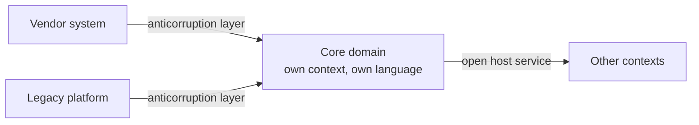

# Core Domain

The **core domain** is the [subdomain](Subdomains.md) that is the reason the business
wins. It is what a competitor would have to replicate to take your customers, and it is
the only part of the system where full [DDD](../index.md) reliably pays for itself.

Everything else in strategic design exists to protect it: boundaries so it can change
without breaking others, and buy-or-outsource decisions so the budget reaches it.

## Identifying it

Useful questions, in rough order of how much signal they carry:

- **If a competitor had this tomorrow, would we lose?** That is the sharpest test.
- **Where does the money come from?** Not the transaction that collects it, the
  capability that earns it.
- **What do domain experts argue about?** Contested rules mean live, valuable knowledge.
  Nobody argues about a login form.
- **What changes most often for business reasons?** The core is rarely stable.

Beware the two false positives: the part with the most code, and the part that is
technically hardest. A gnarly integration is difficult, not differentiating.

## What it earns

| Investment | Applied to the core | Applied elsewhere |
|---|---|---|
| Deep [ubiquitous language](../Ubiquitous%20Language.md) work | Rules become reviewable by experts | Ceremony over a CRUD screen |
| Rich [domain model](../Domain%20Model.md), aggregates, value objects | Change stays cheap for years | Overhead with no payoff |
| Your strongest engineers | Compounding advantage | Expensive people on solved problems |
| Continuous refactoring toward deeper insight | Breakthroughs that simplify whole rule sets | Churn |

## Protect it

- **Give it its own [bounded context](Bounded%20Contexts.md)**, so nothing else forces
  changes on it.
- **Wrap every dependency it has on legacy or vendor systems in an
  [anticorruption layer](Context%20Maps.md)**, so no foreign model gets a vote in how
  the core is expressed.
- **Never let the core be downstream conformist** to a model you do not control. That is
  handing your differentiator's vocabulary to someone else.
- **Keep it in-house.** Outsourcing the core outsources the learning, and the learning
  is the asset.

## It moves

A core domain is a snapshot, not a permanent label. Route optimisation was core for
delivery companies in 2005 and is largely a purchasable service now. When a core
capability commoditises, the correct response is to stop investing and buy the
replacement, then find where the advantage moved.

Reviewing the classification roughly once a year is enough, and it is best done with the
people who own the business strategy rather than inside the engineering team.

## The distillation habit

Cores are usually found tangled with supporting code. The practical technique is
**distillation**: repeatedly separate the differentiating rules from the mechanics
around them, until the core can be read on its own.

Signs it is still tangled: pricing rules interleaved with PDF generation, or the
underwriting engine reachable only through a screen controller. Extracting those is
often the highest-value refactor available, because it is what makes the core cheap to
change.

## Check Your Understanding

<quiz>
Which is the best test for whether something is the core domain?

- [ ] It contains the most code
- [ ] It is the most technically difficult part to build
- [x] A competitor gaining the same capability would erase the business's advantage
> Correct. Difficulty and size measure effort, not differentiation.
- [ ] It has the most database tables
</quiz>

<quiz>
Why should the core domain never be a conformist downstream of a vendor's model?

- [ ] Because vendor APIs are unreliable
- [x] Because adopting their model hands the vocabulary and shape of your differentiator to someone outside the business
> Correct. An anticorruption layer keeps the core expressed in its own language regardless of what it integrates with.
- [ ] Because conformist relationships are always forbidden in DDD
- [ ] Because vendor models cannot be translated
</quiz>

<quiz>
A capability that was core five years ago is now available as a commodity service. What should the business do?

- [ ] Keep investing, since the existing model is already built
- [x] Stop investing, buy the replacement, and identify where the advantage has moved
> Correct. Core is a snapshot of where a business competes today, and the classification is worth revisiting periodically.
- [ ] Reclassify it as a supporting subdomain and keep the same team on it
- [ ] Split it into several bounded contexts
</quiz>
