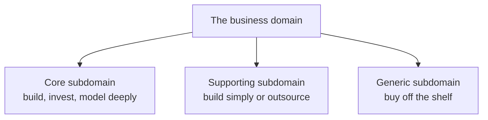

# Subdomains

A **domain** is everything the business does. A **subdomain** is one coherent part of it,
such as underwriting, payments, or reporting. Subdomains live in the *problem space*:
they exist whether or not any software has been written, and you discover them rather
than design them.

Their purpose is budgeting. Not every part of a business justifies the same investment,
and [DDD](../index.md) is expensive enough that spending it uniformly is a way to run
out of time before the important part is good.

## Three kinds

| Type | Definition | Strategy | Who builds it |
|---|---|---|---|
| **[Core](Core%20Domain.md)** | The reason customers choose you over a competitor | Build in-house, full DDD, best people | Your strongest team |
| **[Supporting](Supporting%20and%20Generic%20Domains.md)** | Necessary and specific to you, but no competitive edge | Build simply, or outsource | A smaller team, or a contractor |
| **[Generic](Supporting%20and%20Generic%20Domains.md)** | Solved identically everywhere, such as authentication | Buy it | Nobody, you write a cheque |

## An example

An insurance company:

- **Core**: risk pricing and underwriting rules. It is why their loss ratio beats the
  competition, and it changes constantly.
- **Supporting**: broker commission tracking. Specific to their arrangements, needed,
  but no customer chose them for it.
- **Generic**: document storage, identity, email delivery, accounting ledger. Buy all
  four.

The recurring mistake is inverted effort: a beautifully modelled in-house document
management system, and underwriting rules living in a spreadsheet and three stored
procedures.

## Subdomain is not bounded context

| | Subdomain | [Bounded context](Bounded%20Contexts.md) |
|---|---|---|
| Space | Problem, the business as it is | Solution, a boundary you drew |
| Origin | Discovered | Designed |
| Changed by | The business changing | A refactor |

Aim for one context per subdomain. Where they diverge, the mismatch names your problem:
a single legacy system covering three subdomains cannot be invested in selectively,
which is exactly why the core inside it is hard to improve.

## Classifying honestly

Ask, for each candidate:

- **Would a competitor with the same capability erase our advantage?** If yes, it is
  core.
- **Could we buy this and be no worse off?** If yes, it is generic, whatever pride says.
- **Is it specific to us but invisible to customers?** Supporting.

Two cautions. Classification is per business, not per industry: shipping logistics is
generic for a bookshop and core for a freight company. And it moves over time, since
today's differentiator becomes tomorrow's commodity, which is exactly when to stop
investing and start buying.

## Check Your Understanding

<quiz>
Which part of a system most deserves full DDD effort?

- [ ] The authentication module
- [ ] Whichever part has the most database tables
- [x] The core subdomain, meaning the part that is the reason the business wins
> Correct. Generic subdomains should be bought and supporting ones built simply. Effort spent outside the core is largely wasted.
- [ ] All parts equally, for consistency
</quiz>

<quiz>
Is shipping logistics a core or a generic subdomain?

- [ ] Always core, since delivery affects every customer
- [ ] Always generic, since shipping software can be bought
- [x] It depends on the business: generic for an online bookshop, core for a freight company
> Correct. Classification is relative to where a specific business competes, not to the industry the capability belongs to.
- [ ] Neither, logistics is always a supporting subdomain
</quiz>

<quiz>
How do subdomains relate to bounded contexts?

- [ ] They are the same concept viewed at different zoom levels
- [x] Subdomains are discovered parts of the problem space, contexts are designed boundaries in the solution space, and the aim is one context per subdomain
> Correct. Divergence between them, such as one legacy system spanning three subdomains, usually marks where investment cannot be targeted.
- [ ] Each bounded context contains several subdomains by definition
- [ ] Subdomains only exist once the software has been built
</quiz>
