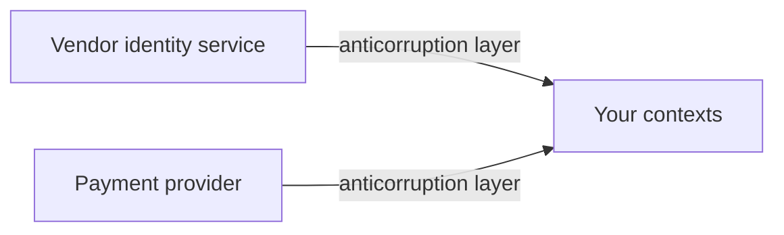

# Supporting and Generic Domains

Everything that is not the [core domain](Core%20Domain.md) still has to exist. The
question is how little you can spend on it, because every hour spent here is an hour not
spent where the business competes.

## Supporting subdomains

A **supporting subdomain** is specific to your business but not a differentiator. Broker
commission tracking, an internal approval workflow, a bespoke onboarding checklist: you
cannot buy them because they encode your particular arrangements, and no customer chose
you for them.

Strategy: **build, but build cheaply.**

- A straightforward [layered](../../Architectural%20Patterns/Layered%20Architecture.md)
  or CRUD design is the right answer. An
  [anemic model](../Domain%20Model.md) here is honest, not a failure.
- Skip aggregates, repositories and elaborate modelling. The rules are thin enough that
  the ceremony costs more than it returns.
- A reasonable place for a smaller team, a contractor, or a low-code tool.
- Still give it its own [bounded context](Bounded%20Contexts.md), so its simplicity
  cannot infect the core and its churn cannot break anything.

## Generic subdomains

A **generic subdomain** is solved the same way in every company: authentication, email
delivery, document storage, payments, the accounting ledger, search infrastructure.

Strategy: **buy it, and integrate behind an
[anticorruption layer](Context%20Maps.md).**

The layer matters. Buying is the cheap decision; letting the vendor's model spread
through your code is what makes replacing them later a rewrite.

## Comparison

| | [Core](Core%20Domain.md) | Supporting | Generic |
|---|---|---|---|
| Differentiates | Yes | No | No |
| Specific to you | Yes | Yes | No |
| Decision | Build with full DDD | Build simply | Buy |
| Modelling effort | High | Low | None |
| Who | Strongest team | Small team or contractor | A purchase order |

## The build-it-ourselves trap

The most common and most expensive misallocation in software: an in-house identity
system, an in-house job scheduler, an in-house rules engine, each a year of work in a
generic subdomain, while the core is a spreadsheet with macros.

The reasoning is always locally plausible. "Our authentication needs are unusual" is
almost never true, and the requirement that appears unusual is usually a business rule
that belongs in your own context anyway, sitting on top of a bought identity provider.

Legitimate reasons to build a generic subdomain are narrow: a regulatory constraint no
vendor satisfies, a scale no product supports, or a cost curve that genuinely inverts at
your volume. Each should be argued explicitly and written down, because it will be
questioned in two years.

## Reclassification

Subdomains move in both directions:

- **Core becomes generic** when the market commoditises it. Stop investing and buy.
- **Supporting becomes core** when the business decides to compete on it. That is a
  deliberate decision, and it comes with a real investment, not just a new label.

Do not let a supporting subdomain drift into receiving core-level effort because the
team finds it interesting. That drift is quiet, and the cost is visible only in what did
not get built.

## Check Your Understanding

<quiz>
An anemic domain model is used for an internal approval workflow. Is that a problem?

- [ ] Yes, DDD requires a rich model everywhere
- [x] No. In a supporting subdomain the rules are thin, and a simple CRUD or layered design costs less than the modelling ceremony would return
> Correct. Rich modelling is reserved for the core, where it pays for itself.
- [ ] Yes, because supporting subdomains still need aggregates
- [ ] Only if the workflow is exposed to customers
</quiz>

<quiz>
Why integrate a bought generic subdomain behind an anticorruption layer?

- [ ] To improve its performance
- [x] Because otherwise the vendor's model spreads through your code, making a later replacement a rewrite rather than a swap of one class
> Correct. Buying is cheap. Coupling to what you bought is what becomes expensive.
- [ ] Because vendors require it contractually
- [ ] Because generic subdomains cannot be called directly
</quiz>

<quiz>
A team argues that their authentication needs are unusual enough to justify building their own identity system. What is the likely reality?

- [ ] They are correct, since every business has distinct security requirements
- [x] The genuinely unusual part is a business rule that belongs in their own context, layered on top of a bought identity provider
> Correct. Building in a generic subdomain needs a narrow, explicit justification such as regulation, scale, or an inverted cost curve.
- [ ] It does not matter, since authentication is a supporting subdomain
- [ ] They should build it, but with a rich domain model
</quiz>
