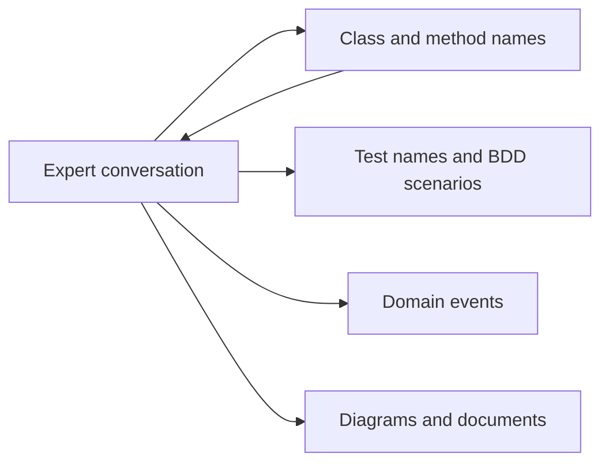

# Ubiquitous Language

The **ubiquitous language** is a single vocabulary shared by domain experts, developers,
tests and code. Not a glossary appendix, and not documentation: the actual words used in
conversation, in the same meanings, appearing verbatim as class and method names.

It is the foundation of [DDD](index.md), because every other pattern assumes the team
can say precisely what it means.

## The translation tax

Without it, every conversation pays a translation cost:

| Domain expert says | Code says | Result |
|---|---|---|
| A policy *lapses* | `policy.setStatus(3)` | Nobody can review the rule |
| A shipment is *consolidated* | `mergeOrders()` | Two concepts silently merged |
| An invoice is *voided* | `invoice.delete()` | The audit requirement disappears |

Each row is a place where the expert cannot read the code, so the expert cannot catch
the bug, so it ships. The translation also decays: after two years, the code's words
have drifted and the original meaning survives only in one person's head.

## Discovered, not invented

The language comes from the people who do the work, and the fastest way to find it is to
listen for the nouns and verbs they use unprompted.

- **Take their word, not a synonym.** If they say *carrier*, the class is `Carrier`, not
  `ShippingProvider`.
- **Push back when a term is vague.** "We just process it" hides a rule. Ask what
  changes, and what could go wrong.
- **When two experts disagree about a word**, that is a finding, not a nuisance: you are
  usually standing on a [bounded context](Strategic%20DDD/Bounded%20Contexts.md)
  boundary, and the honest fix is two models, not one compromise word.
- **Feed changes back.** When a better term appears, rename in the code the same day.
  A language that only flows one way stops being shared.

## Where it shows up



Same words in all four. The
[BDD scenarios](../../Methodologies/Development%20Practices/Behaviour-Driven%20Development.md)
a team writes are usually the most visible artifact of the language, because the
business reads them directly.

## Before and after

```python
# Not the language: technical verbs, a magic status code, no rule visible
def update_record(policy_id, status):
    db.execute("UPDATE policies SET status=? WHERE id=?", status, policy_id)
```

```python
# The language: the expert can read this and say whether it is right
class Policy:
    def lapse(self, on: date) -> None:
        if self.premium_paid_through >= on:
            raise PremiumStillCovered(self.id)
        self.status = PolicyStatus.LAPSED
        self.lapsed_on = on
```

The second version made a rule explicit that the first version did not contain at all.
That is the usual outcome: adopting the language surfaces missing rules.

## The test

Read a method name and its parameters aloud to a domain expert. If they cannot tell you
whether it matches how the business behaves, the code is not speaking the language yet.

## Check Your Understanding

<quiz>
Two domain experts insist the word "shipment" means different things. What is the DDD response?

- [ ] Pick the more senior expert's definition
- [ ] Invent a neutral third term both can accept
- [x] Treat it as a signal of a context boundary, and let each bounded context keep its own meaning
> Correct. A compromise term satisfies nobody and hides the fact that these are two models.
- [ ] Store both meanings as fields on one class
</quiz>

<quiz>
What is the practical test that a codebase speaks the ubiquitous language?

- [ ] Every class has a docstring
- [ ] A glossary document exists and is up to date
- [x] A domain expert can read a method name and say whether it matches how the business behaves
> Correct. The language lives in the code and the conversation, not in a separate document that drifts.
- [ ] Variable names are longer than eight characters
</quiz>
