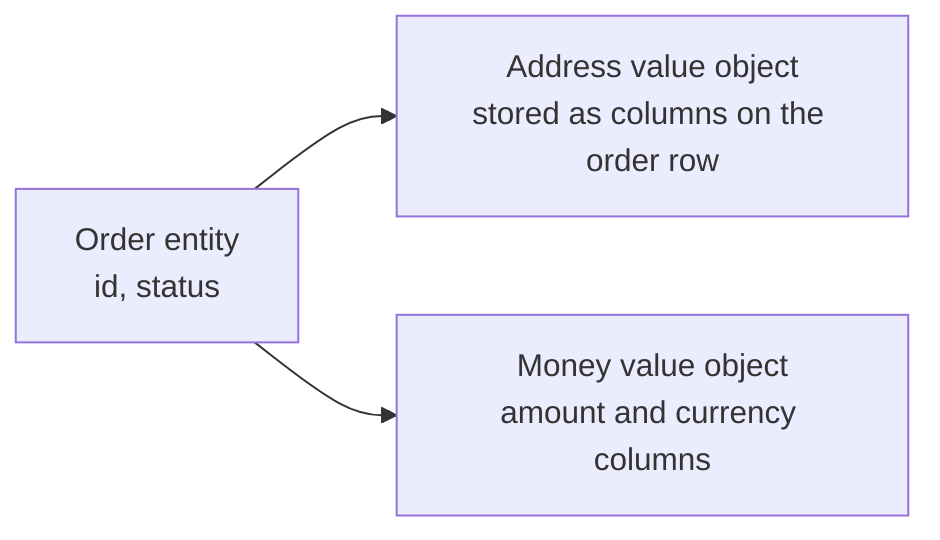

# Value Objects

A **value object** describes something rather than identifying it. Two instances with
equal contents are interchangeable: `Money(10, "EUR")` is the same money as any other
`Money(10, "EUR")`, exactly as `5` is the same number as `5`.

This is the cheapest and highest-value pattern in [DDD](index.md). It needs no
aggregates, no repositories and no bounded contexts to pay off, and a team that adopts
nothing else still comes out ahead.

## The three properties

1. **No identity.** Equality is by all fields.
2. **Immutable.** Operations return a new instance instead of mutating.
3. **Self-validating.** A value object that exists is valid, because its constructor
   refused everything else.

```python
@dataclass(frozen=True)
class Money:
    amount: Decimal
    currency: str

    def __post_init__(self):
        if self.amount.as_tuple().exponent < -2:
            raise ValueError("sub-cent precision not allowed")

    def __add__(self, other: "Money") -> "Money":
        if self.currency != other.currency:
            raise CurrencyMismatch(self.currency, other.currency)
        return Money(self.amount + other.amount, self.currency)
```

`frozen=True` gives immutability and a value-based `__eq__` and `__hash__` at once.

## Why immutability matters

A shared mutable value is a bug waiting for a second reference:

```python
# Mutable: changing one order's address silently changes the other's
addr = Address("Main St 1", "Berlin")
order_a.address = addr
order_b.address = addr
order_a.address.street = "Side St 2"   # order_b just moved
```

With an immutable value object, "changing" means replacing:
`order_a.address = addr.with_street("Side St 2")`. Nothing else can observe the change.
Immutability also makes values safe to share across threads and usable as dictionary
keys.

## Primitive obsession

The usual smell value objects cure:

```python
# Before: four parameters, any two of which can be swapped without complaint
def transfer(amount: float, currency: str, from_iban: str, to_iban: str): ...

# After: wrong combinations stop being expressible
def transfer(amount: Money, source: Iban, target: Iban): ...
```

The `float` for money is its own defect: `0.1 + 0.2` is not `0.3`, and rounding errors
in a ledger are found by auditors, not tests. `Money` wrapping a `Decimal` fixes it once
for the whole system.

Good candidates: `Money`, `EmailAddress`, `PhoneNumber`, `Iban`, `PostalCode`,
`DateRange`, `Percentage`, `Quantity`, `Colour`, `Coordinates`.

## Behaviour belongs on them

Value objects are where small domain rules go to be reused:

```python
@dataclass(frozen=True)
class DateRange:
    start: date
    end: date

    def __post_init__(self):
        if self.end < self.start:
            raise ValueError("end before start")

    def overlaps(self, other: "DateRange") -> bool:
        return self.start <= other.end and other.start <= self.end

    def days(self) -> int:
        return (self.end - self.start).days + 1
```

`overlaps` written once beats the same three-line comparison copied into six services,
where one copy will have the boundary wrong.

## Persistence

Value objects usually do not get their own table. They are stored inline on the owning
[entity](Entities.md)'s row, which is why `Address` becomes
`shipping_street`, `shipping_city`, `shipping_postcode` columns rather than a joined
table with an artificial identifier.



## When not to

- The thing must be tracked individually over time, even when its data is identical.
  That is an [entity](Entities.md).
- The type is genuinely just a bag of unrelated fields with no rules, where a plain
  record is honest and enough.
- Very large collections of tiny values in a hot loop, where allocation cost is measured
  and matters. Measure first, because this is rarely the real bottleneck.

## Check Your Understanding

<quiz>
Why must a value object be immutable?

- [ ] Because databases cannot update embedded columns
- [x] Because instances are shared freely by value, so mutating one would silently change every other holder of the same instance
> Correct. Replacement instead of mutation also makes them thread-safe and usable as dictionary keys.
- [ ] Because immutable objects use less memory
- [ ] Because equality cannot be defined on mutable types
</quiz>

<quiz>
A system passes money around as a `float` amount plus a `str` currency. What does introducing a `Money` value object fix?

- [ ] Only the naming
- [x] Rounding errors from binary floats, mismatched-currency arithmetic, and parameter swaps, all in one place instead of at every call site
> Correct. The constructor and the operators enforce once what every caller previously had to remember.
- [ ] Nothing, since the same checks could be added to each service
- [ ] It makes serialization to JSON simpler
</quiz>

<quiz>
Should `Address` normally be an entity or a value object?

- [ ] An entity, so it can be shared between customers
- [x] A value object, because two addresses with the same contents are interchangeable and it has no life of its own
> Correct. Giving it an identifier invites duplicate rows and a table nobody needed.
- [ ] An entity, because it is persisted
- [ ] Either, since the distinction is only stylistic
</quiz>
