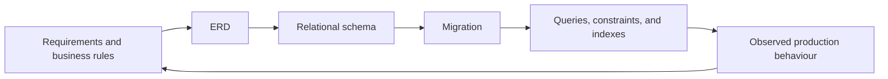

# Data Modeling and RDBMS

An **entity-relationship diagram (ERD)** is a model of the information a system must remember. A **relational database management system (RDBMS)** is the software that stores that model in related tables and protects its rules while many requests run at once.

This tutorial moves from product language to a dependable relational schema. The running example is a small online store: customers place orders; orders contain products; products belong to categories.

An ERD is not merely a diagram to hand to a database administrator. It forces useful questions early:

- What things must have independent identities?
- Which facts belong to each thing?
- Which relationships are required, optional, or many-to-many?
- What states are valid, and what must never happen?
- Which reads and writes must be fast and correct?

## Tutorial map

1. [ERD Fundamentals](ERD%20Fundamentals.md) turns requirements into entities, attributes, cardinality, and optionality.
2. [Relational Database Fundamentals](Relational%20Database%20Fundamentals.md) maps an ERD to tables, rows, and columns.
3. [Keys and Relationships](Keys%20and%20Relationships.md) explains primary, foreign, candidate, and composite keys, plus relationship patterns.
4. [Normalization](Normalization.md) removes accidental duplication while preserving important business facts.
5. [Integrity and Transactions](Integrity%20and%20Transactions.md) keeps invalid data and partial business operations out of the system.
6. [Query Design and Indexes](Query%20Design%20and%20Indexes.md) makes access patterns efficient without guessing.
7. [Worked Example: Online Store](Worked%20Example%20-%20Online%20Store.md) puts the pieces together in PostgreSQL-flavoured SQL.

## ERD and schema are different views

| View | Main question | Typical notation |
| --- | --- | --- |
| Conceptual ERD | What concepts exist in the domain? | `Customer places Order` |
| Logical model | What attributes and relationships must be represented? | `Order(customer_id, placed_at, status)` |
| Physical schema | How will a particular database store and access it? | SQL types, indexes, partitions, storage settings |

Start conceptual and make the model more concrete only when you can explain the decision. A diagram that exposes every implementation detail is difficult to discuss; a diagram with no keys or cardinalities is too vague to implement.

## The running vocabulary

| Business term | Meaning in the store |
| --- | --- |
| Customer | A person allowed to place orders |
| Product | An item offered for sale |
| Order | A customer’s purchase attempt at a point in time |
| Order line | One product and its quantity within an order |
| Category | A way to group products for browsing |

The next page begins with how to identify these concepts without modeling every word in a requirements document.

## A useful rule

Model **facts the system must preserve**, not just the screens it currently displays. A checkout page may show a product’s current name and price, but an old order must usually preserve the name and price that were accepted at purchase time. That distinction becomes central in the normalization and worked-example sections.

<quiz>
Which statement best distinguishes an ERD from an RDBMS?

- [x] An ERD models the domain and its relationships; an RDBMS stores and enforces a relational implementation of that model
> Correct. A diagram guides the design, while the database is the executing system that persists and protects data.
- [ ] An ERD is a type of production database server
- [ ] An RDBMS only stores unstructured documents
- [ ] They are two names for the same SQL file
</quiz>
