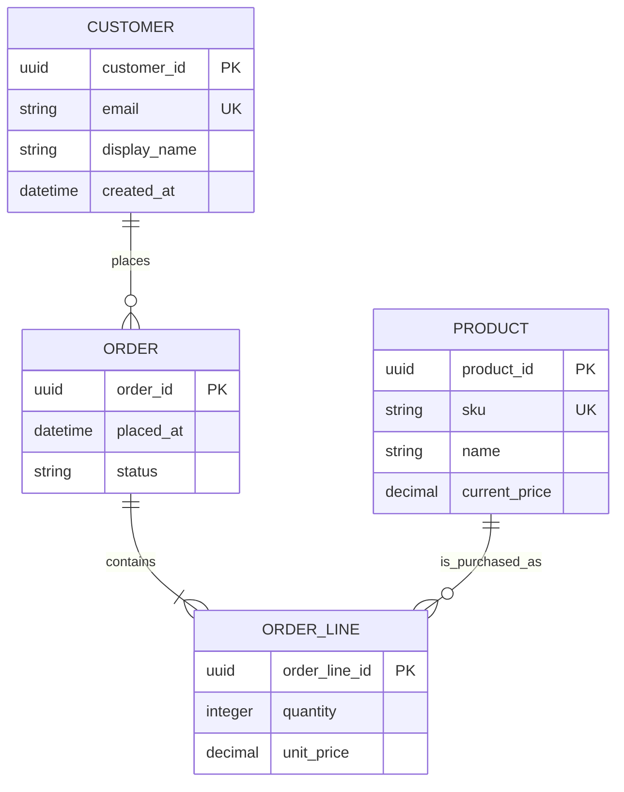
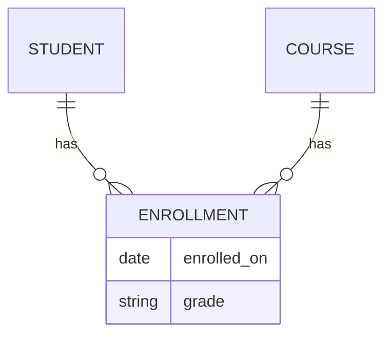

# ERD Fundamentals

An ERD describes **entities** (things the business cares about), their **attributes** (facts about those things), and **relationships** (how they are connected). It should reflect business rules, not accidental details of a user interface or one programming language.

## 1. Extract candidates from requirements

Read requirements and highlight nouns, verbs, and rules. Nouns suggest entities; verbs suggest relationships; rules suggest cardinality, optionality, or constraints.

> A customer can place many orders. Each order is placed by one customer. An order contains one or more products. A product can appear in many orders.

This sentence suggests `Customer`, `Order`, and `Product`. It also hides a fourth entity: `OrderLine`. The relationship between orders and products has its own facts, such as quantity and price at purchase time, so it cannot be only a line between two boxes.

## 2. Draw entities and attributes

At the logical level, list the identity and essential facts of each entity. Do not try to list every possible column immediately.

`PK` means primary key and `UK` means unique key. The Mermaid diagram communicates the structure; the business rules below explain what the symbols mean.

## 3. Read cardinality and optionality

Crow’s-foot notation uses two ideas at each end of a relationship:

| Marker | Meaning |
| --- | --- |
| `||` | exactly one |
| `o|` | zero or one |
| `|{` | one or more |
| `o{` | zero or more |

For `CUSTOMER ||--o{ ORDER`, each order has exactly one customer, while a customer may have zero or many orders. For `ORDER ||--|{ ORDER_LINE`, a persisted order must contain at least one line; every order line belongs to exactly one order.

Say relationships out loud in both directions. This reveals missing rules quickly:

- A customer **may place zero or many** orders.
- An order **must be placed by exactly one** customer.
- An order **contains one or more** order lines.
- An order line **describes exactly one** product.

## 4. Choose entity, attribute, or relationship

Use an entity when something has its own identity, lifecycle, relationships, or several independent attributes. Use an attribute when it is a single-valued fact about one entity.

| Candidate | Better model | Why |
| --- | --- | --- |
| `customer_email` | Attribute of `Customer` | One value identifies contact address in this simplified domain |
| `shipping_address` | Usually entity or value-object columns | It has multiple fields and may be reused or snapshotted |
| `quantity` | Attribute of `OrderLine` | It describes the order-product relationship |
| `ProductCategory` | Entity/relationship | Products can belong to categories, and categories have names and hierarchy |
| `order_status_history` | Entity when history matters | A sequence of state changes has time, actor, and reason |

### The relationship-with-attributes test

If a relationship has facts of its own, create an associative entity (also called a junction, bridge, or link table). `OrderLine` holds `quantity`, `unit_price`, and possibly tax or discount. A bare many-to-many line cannot hold them.

## 5. Capture rules next to the ERD

Not every rule fits in a box or a crow’s foot. Write a small rule list and assign each rule to a later enforcement mechanism.

| Rule | Likely enforcement |
| --- | --- |
| Customer email is unique | `UNIQUE` constraint |
| Quantity is positive | `CHECK` constraint |
| An order must have a customer | `NOT NULL` plus foreign key |
| Only a paid order may be shipped | Transactional application/domain rule, possibly state constraints |
| A product SKU never changes after sale | Business process and audit policy |

## Common ERD mistakes

- Modeling a report or API response as if it were a durable entity.
- Leaving cardinality off the diagram. “Customer relates to order” is ambiguous.
- Storing repeating values in numbered attributes, such as `phone_1`, `phone_2`, and `phone_3`.
- Drawing a direct many-to-many relationship even though it has attributes.
- Treating a nullable relationship as automatically optional in the business sense. Confirm the rule.

## Before moving to tables

For each entity, be able to answer: How is it uniquely identified? Which attributes are required? Who creates it? Can it change or be deleted? What other entity refers to it? Which queries must find it?

The [Relational Database Fundamentals](Relational%20Database%20Fundamentals.md) page translates that diagram into tables.

<quiz>
An order can contain many products, and the system must store the quantity of each product in the order. What should the model include?

- [x] An `OrderLine` entity related to both `Order` and `Product`
> Correct. Quantity belongs to the relationship between a particular order and product.
- [ ] A comma-separated product list in `Order`
- [ ] A `quantity` column on `Product`
- [ ] A direct many-to-many line with no entity between it
</quiz>
