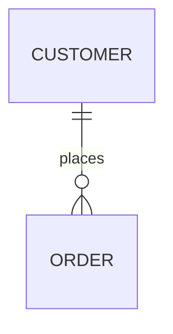

# Keys and Relationships

Keys give rows an identity and connect tables without copying every related fact. They are the structural backbone of a relational design.

## Primary, candidate, natural, and surrogate keys

A **primary key (PK)** is the chosen, unique, non-null identifier for a row. A **candidate key** is any minimal set of columns that could uniquely identify it. The primary key is one candidate selected as the main reference point.

```sql
CREATE TABLE products (
    product_id UUID PRIMARY KEY,       -- surrogate primary key
    sku        TEXT NOT NULL UNIQUE,   -- alternate candidate key
    name       TEXT NOT NULL
);
```

| Key style | Example | Strength | Risk |
| --- | --- | --- | --- |
| Natural key | Email, ISO country code, SKU | Meaningful and externally recognizable | Business meaning may change; values may be long or sensitive |
| Surrogate key | Generated UUID or integer | Stable and compact relationship target | Still need `UNIQUE` rules for natural identifiers |
| Composite key | `(order_id, line_number)` | Encodes a genuine scoped identity | Propagates multiple columns into referencing tables |

A common default is a surrogate PK plus unique constraints for important business identifiers. Do not assume an email or external provider ID is immutable forever just because it is unique today.

## Foreign keys protect references

A **foreign key (FK)** says that a value in one table must refer to an existing key in another table (or, in a self-reference, the same table).

```sql
CREATE TABLE order_lines (
    order_line_id UUID PRIMARY KEY,
    order_id      UUID NOT NULL REFERENCES orders(order_id),
    product_id    UUID NOT NULL REFERENCES products(product_id),
    quantity      INTEGER NOT NULL CHECK (quantity > 0)
);
```

Without the foreign keys, an application could store an order line for a deleted or misspelled product ID. That creates an orphaned record and breaks joins, reports, and later business logic.

## Map each relationship shape

### One-to-many

Put the FK on the many side.



```sql
ALTER TABLE orders
ADD CONSTRAINT orders_customer_fk
FOREIGN KEY (customer_id) REFERENCES customers(customer_id);
```

### One-to-one

Use a foreign key that is also `UNIQUE`; make it `NOT NULL` when the relationship is mandatory in that direction.

```sql
CREATE TABLE customer_preferences (
    customer_id UUID PRIMARY KEY REFERENCES customers(customer_id),
    marketing_opt_in BOOLEAN NOT NULL DEFAULT false
);
```

Here the PK is also the FK, so each customer can have at most one preferences row. Splitting a one-to-one table is useful for optional, sensitive, rarely loaded, or separately owned attributes—not merely because two columns look different.

### Many-to-many

Create a junction table. Its pair of FKs is often the primary key if a pair may occur only once.

```sql
CREATE TABLE product_categories (
    product_id  UUID NOT NULL REFERENCES products(product_id),
    category_id UUID NOT NULL REFERENCES categories(category_id),
    PRIMARY KEY (product_id, category_id)
);
```

If the association has its own identity or is referenced elsewhere, use a surrogate key as well and add a unique constraint for `(product_id, category_id)`.

### Recursive relationship

A table may reference itself. For example, a category can have an optional parent category.

```sql
CREATE TABLE categories (
    category_id UUID PRIMARY KEY,
    name        TEXT NOT NULL,
    parent_id   UUID REFERENCES categories(category_id)
);
```

The FK prevents a nonexistent parent but does not by itself prevent cycles such as A → B → A. If cycles are invalid, enforce them in the write path or with a carefully designed database rule.

## Deletion rules are business rules

Every FK needs an intentional answer to “what happens when the referenced row is deleted?”

| Action | Meaning | Typical fit |
| --- | --- | --- |
| `RESTRICT` / default no action | Reject deletion while children exist | Keep an order’s customer/product history intact |
| `CASCADE` | Delete dependent rows too | A draft’s temporary child records |
| `SET NULL` | Preserve child but remove optional link | Optional assignee on a retired account |
| Soft delete | Mark the row inactive instead | Audit/history requirements, but adds query complexity |

Never add `ON DELETE CASCADE` just to avoid an error. A cascade can be correct, but it can also turn one mistaken deletion into a large loss of history.

## Relationship index rule

Most RDBMSs create an index for a primary or unique key. They do not always automatically index a foreign-key column. Index FKs used for joins, filters, and delete/update checks; the [Query Design and Indexes](Query%20Design%20and%20Indexes.md) page shows how to choose and verify those indexes.

<quiz>
How do you enforce that a customer can have at most one preferences row?

- [x] Make `customer_preferences.customer_id` both a foreign key and unique (often the primary key)
> Correct. The FK requires a real customer; uniqueness prevents a second preferences row for the same customer.
- [ ] Add a second `customer_id` column to `customers`
- [ ] Use a comma-separated list of preferences in the order table
- [ ] Add an index with no uniqueness requirement
</quiz>
