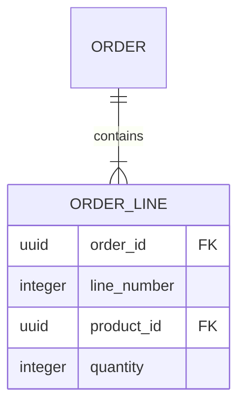
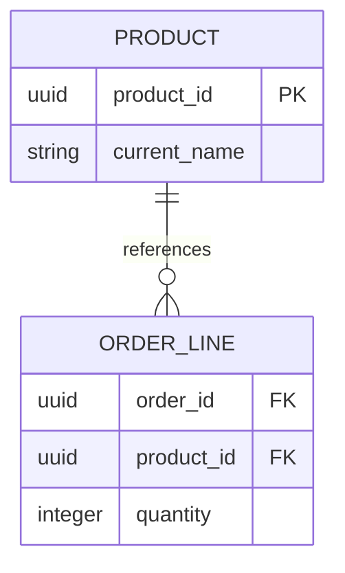

# Normalization

**Normalization** organizes relational data so each fact has one clear home. Its aim is to prevent update anomalies: changes that accidentally leave contradictory, missing, or invented facts behind.

Normalization is not a competition to create the most tables. It is a reasoning tool. Start with a clean model, then denormalize deliberately only when an observed access pattern justifies the cost.

## The problem: repeated facts disagree

Imagine one wide table for an order:

| order_id | customer_email | product_1 | quantity_1 | product_2 | quantity_2 |
| --- | --- | --- | --- | --- | --- |
| 101 | ada@example.com | Keyboard | 1 | Mouse | 2 |

It has three classic problems:

- **Update anomaly:** if Ada changes her email, every historical order must be edited consistently.
- **Insert anomaly:** a product cannot exist until somebody orders it.
- **Delete anomaly:** deleting Ada’s last order erases the only customer record.

Numbered product columns are also a repeating group: there is no principled maximum number of products in an order.

## First normal form (1NF): atomic values and no repeating groups

At 1NF, each cell holds one value in the chosen domain, rows are identifiable, and repeated groups become rows or a related table.



`order_lines(order_id, line_number, product_id, quantity)` can represent any number of items. Whether a value is “atomic” depends on the domain: a full name may be one value if never separately searched, while an address usually needs structured components for shipping and tax rules.

## Second normal form (2NF): facts depend on the whole key

2NF matters when a table has a composite key. Every non-key attribute must depend on the *entire* key, not only part of it.

Suppose an order-line table uses `(order_id, product_id)` as its key:

| order_id | product_id | product_name | quantity |
| --- | --- | --- | --- |

`quantity` depends on the pair: it describes this product in this order. But `product_name` depends only on `product_id`. Put the current product name in `products` instead.



## Third normal form (3NF): non-key facts depend only on the key

At 3NF, non-key columns should not depend on other non-key columns. For example, avoid this customer table:

| customer_id | postal_code | city | state |
| --- | --- | --- |

If business rules say postal code determines city and state, then `city` and `state` depend transitively on `customer_id` through `postal_code`. Consider a reference table when that relationship is reliable in the relevant country and worth maintaining. Do not normalize based only on a simplistic real-world assumption; postal data can be complex.

A clearer example is storing category name on every product when it is determined by `category_id`:

```sql
-- Better: one authoritative category name.
CREATE TABLE categories (
    category_id UUID PRIMARY KEY,
    name TEXT NOT NULL UNIQUE
);

CREATE TABLE products (
    product_id UUID PRIMARY KEY,
    category_id UUID NOT NULL REFERENCES categories(category_id),
    name TEXT NOT NULL
);
```

## Functional dependencies are the underlying idea

Write `X → Y` to mean X determines Y. For example:

- `product_id → current_name, current_price`
- `(order_id, line_number) → product_id, quantity, unit_price`
- `customer_id → email, display_name`

If a table holds a fact whose determinant is not a key of that table, ask whether the fact belongs somewhere else. This is more durable than memorizing normal-form slogans.

## Historical snapshots are intentional duplication

Normalization does **not** mean that every repeated-looking value is a bug. An order line should usually store `unit_price_at_purchase` and often `product_name_at_purchase`:

```sql
CREATE TABLE order_lines (
    order_id UUID NOT NULL REFERENCES orders(order_id),
    line_number INTEGER NOT NULL,
    product_id UUID NOT NULL REFERENCES products(product_id),
    product_name_at_purchase TEXT NOT NULL,
    unit_price_at_purchase NUMERIC(12,2) NOT NULL,
    quantity INTEGER NOT NULL CHECK (quantity > 0),
    PRIMARY KEY (order_id, line_number)
);
```

The current catalog price is a different fact from the agreed sale price. This duplication preserves history and makes invoices reproducible. Document it as a snapshot; do not later “fix” it by updating old orders when a product is renamed.

## Denormalization: optimize with a contract

After measuring a real bottleneck, you may store a derived copy such as `orders.total_amount`, a daily sales summary, or a search projection. Before doing so, define:

1. The source of truth.
2. How the derived value is updated or rebuilt.
3. Whether readers can see it stale.
4. How drift is detected and repaired.

Use database constraints where possible, write through one well-tested transaction, and keep a repair path. A denormalized value without an ownership/update rule becomes silent data corruption.

<quiz>
Why is `unit_price_at_purchase` on an order line often correct even if `products.current_price` already exists?

- [x] They represent different facts: the agreed historical price and the current catalog price
> Correct. This is intentional snapshot data, not accidental duplication.
- [ ] It lets the database skip foreign keys
- [ ] Normalization forbids a product price table
- [ ] Prices should always be stored as floating-point numbers
</quiz>
