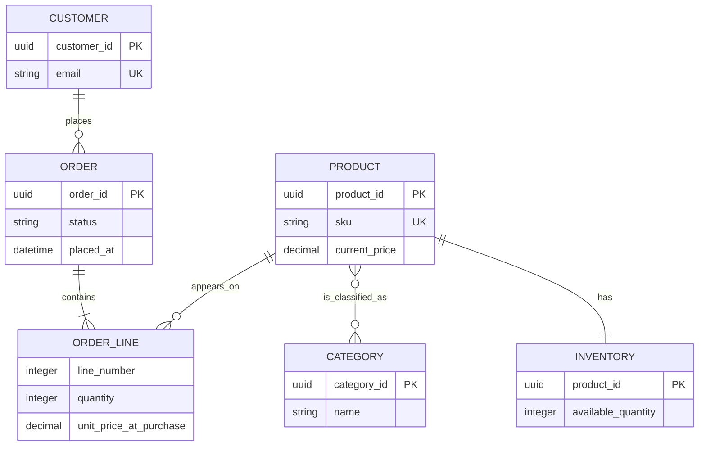

# Worked Example: Online Store

This worked example takes a small store from requirements to a relational design. It favors clear invariants and realistic history over an exhaustive commerce platform.

## Requirements and assumptions

- A customer registers with a unique email address.
- A product has a stable SKU, a current name, a current price, and available stock.
- A product may appear in multiple categories.
- A customer may place many orders; an order has one or more lines.
- A line records the product, quantity, and the name and price accepted at purchase time.
- A product cannot be oversold.
- Customer order history must be fast, newest first.
- Cancelled or inactive catalog products must not erase purchase history.

The intentionally omitted pieces—tax, shipping, returns, payments, discounts, warehouses, and currency conversion—would add entities and rules but do not alter the modeling method.

## Conceptual ERD



The many-to-many `Product ↔ Category` relationship becomes `product_categories`. The `OrderLine` is an associative entity, because it carries quantity and historical snapshot data.

## PostgreSQL-flavoured schema

```sql
CREATE TABLE customers (
    customer_id UUID PRIMARY KEY,
    email TEXT NOT NULL UNIQUE,
    display_name TEXT NOT NULL,
    created_at TIMESTAMPTZ NOT NULL DEFAULT now()
);

CREATE TABLE products (
    product_id UUID PRIMARY KEY,
    sku TEXT NOT NULL UNIQUE,
    name TEXT NOT NULL,
    current_price NUMERIC(12,2) NOT NULL CHECK (current_price >= 0),
    is_active BOOLEAN NOT NULL DEFAULT true,
    created_at TIMESTAMPTZ NOT NULL DEFAULT now()
);

CREATE TABLE inventory (
    product_id UUID PRIMARY KEY REFERENCES products(product_id),
    available_quantity INTEGER NOT NULL CHECK (available_quantity >= 0),
    updated_at TIMESTAMPTZ NOT NULL DEFAULT now()
);

CREATE TABLE categories (
    category_id UUID PRIMARY KEY,
    name TEXT NOT NULL UNIQUE
);

CREATE TABLE product_categories (
    product_id UUID NOT NULL REFERENCES products(product_id),
    category_id UUID NOT NULL REFERENCES categories(category_id),
    PRIMARY KEY (product_id, category_id)
);

CREATE TABLE orders (
    order_id UUID PRIMARY KEY,
    customer_id UUID NOT NULL REFERENCES customers(customer_id),
    status TEXT NOT NULL CHECK (status IN ('pending', 'paid', 'cancelled')),
    placed_at TIMESTAMPTZ NOT NULL DEFAULT now()
);

CREATE TABLE order_lines (
    order_id UUID NOT NULL REFERENCES orders(order_id),
    line_number INTEGER NOT NULL CHECK (line_number > 0),
    product_id UUID NOT NULL REFERENCES products(product_id),
    product_name_at_purchase TEXT NOT NULL,
    unit_price_at_purchase NUMERIC(12,2) NOT NULL
        CHECK (unit_price_at_purchase >= 0),
    quantity INTEGER NOT NULL CHECK (quantity > 0),
    PRIMARY KEY (order_id, line_number)
);
```

`order_lines` uses `(order_id, line_number)` as its key: line 1 is unique only within an order. It retains `product_id` for traceability but intentionally snapshots the name and price, so past receipts stay accurate after catalog changes.

## Add access-pattern indexes

```sql
CREATE INDEX orders_customer_placed_at_idx
    ON orders (customer_id, placed_at DESC, order_id DESC);

CREATE INDEX order_lines_product_idx
    ON order_lines (product_id);

CREATE INDEX product_categories_category_idx
    ON product_categories (category_id, product_id);

CREATE INDEX active_products_by_category_idx
    ON products (product_id)
    WHERE is_active;
```

The first supports customer order history; the middle two support relationship traversal in both directions. The last is only a possible optimization: actual category browsing joins through `product_categories`, so validate it with a plan. In a real system you might instead use a partial index tailored to the full query or an index on the junction table alone.

## Place an order without overselling

The service accepts a requested set of product IDs and quantities. Within a short transaction, it must obtain current product facts, decrement enough inventory for every line, and write the order and its lines. The exact SQL can vary, but the invariant is crisp: an update may decrement stock only when enough stock remains.

```sql
BEGIN;

-- For each requested line, this update succeeds only if stock is available.
UPDATE inventory
SET available_quantity = available_quantity - :quantity,
    updated_at = now()
WHERE product_id = :product_id
  AND available_quantity >= :quantity;

-- The service requires exactly one affected row per requested product.
-- If any update affected zero rows, ROLLBACK the whole transaction.

INSERT INTO orders (order_id, customer_id, status)
VALUES (:order_id, :customer_id, 'pending');

INSERT INTO order_lines (
    order_id, line_number, product_id, product_name_at_purchase,
    unit_price_at_purchase, quantity
)
SELECT
    :order_id, item.line_number, p.product_id, p.name,
    p.current_price, item.quantity
FROM requested_items AS item
JOIN products AS p ON p.product_id = item.product_id
WHERE p.is_active;

COMMIT;
```

Production code must verify that every requested product is active and inserted; otherwise it rolls back. It must also deduplicate repeated product IDs in the request or aggregate their quantities before reservation. Do not assume a transaction makes a partially specified request correct.

## Typical reads

### Customer order history

```sql
SELECT order_id, status, placed_at
FROM orders
WHERE customer_id = :customer_id
ORDER BY placed_at DESC, order_id DESC
LIMIT 20;
```

This aligns with `orders_customer_placed_at_idx` and supports cursor pagination.

### An order receipt

```sql
SELECT o.order_id, o.status, o.placed_at,
       l.line_number, l.product_name_at_purchase,
       l.unit_price_at_purchase, l.quantity
FROM orders AS o
JOIN order_lines AS l ON l.order_id = o.order_id
WHERE o.order_id = :order_id
  AND o.customer_id = :customer_id
ORDER BY l.line_number;
```

The ownership predicate is an authorization check as well as a query filter. The `order_lines` primary key starts with `order_id`, so it efficiently retrieves ordered lines.

### Category browsing

```sql
SELECT p.product_id, p.sku, p.name, p.current_price
FROM product_categories AS pc
JOIN products AS p ON p.product_id = pc.product_id
WHERE pc.category_id = :category_id
  AND p.is_active
ORDER BY p.name, p.product_id
LIMIT 30;
```

Use `EXPLAIN (ANALYZE, BUFFERS)` with a representative catalog before finalizing its index strategy. A name-sort index may become useful only after data size and filter selectivity justify it.

## Change safely

Suppose you need `orders.currency`. A safe expand–migrate–contract approach is:

1. Add a nullable `currency` column or a compatible default.
2. Deploy code that writes it for new orders and reads both old/new forms.
3. Backfill old rows in controlled batches.
4. Verify no nulls remain, then add `NOT NULL` and update dependent constraints.
5. Remove temporary compatibility code in a later deployment.

Backups, restore tests, migration review, query-plan checks, and database metrics are part of this design. An elegant ERD that cannot be changed or recovered safely is incomplete system design.

## What this example teaches

- ERD cardinality becomes `NOT NULL`, FKs, and junction tables.
- Normalization separates the current catalog from historical purchase snapshots.
- Constraints reject simple invalid states close to the data.
- A short transaction plus a conditional update protects inventory under concurrency.
- Indexes follow concrete reads, and plans decide whether the hypothesis holds.

<quiz>
Why does `order_lines` store `product_name_at_purchase` rather than always joining to `products.name` for receipts?

- [x] A receipt should preserve what was sold even if the catalog item is renamed later
> Correct. The line stores an intentional historical snapshot.
- [ ] Foreign keys cannot reference products
- [ ] Product names must never change
- [ ] It removes the need for a primary key
</quiz>
