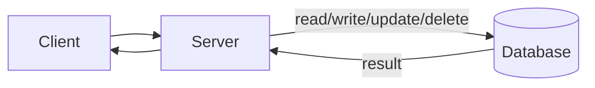
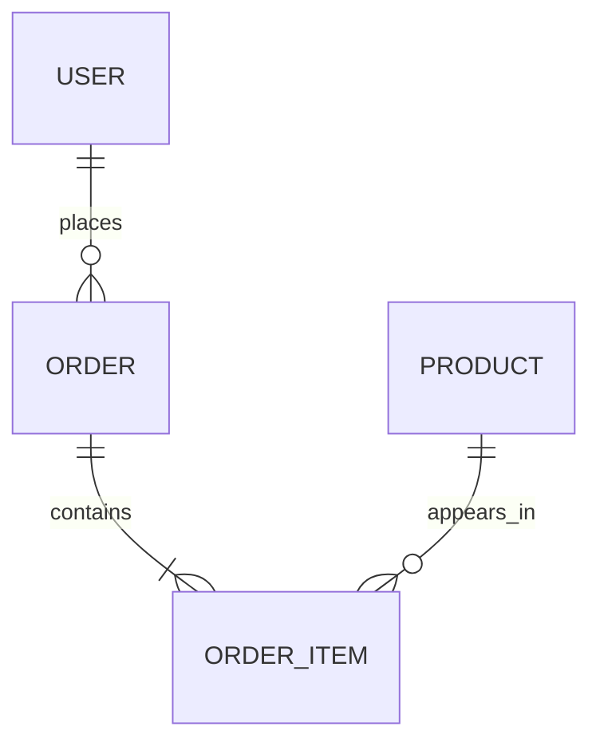

# Databases in System Design

A database stores application data persistently so the system can survive restarts, crashes, deployments, and user sessions ending.

Without a database, a server can respond to requests but cannot reliably remember shared state.

## What Databases Provide

Databases usually provide:

- Durable storage.
- Querying and filtering.
- Indexes for faster lookup.
- Concurrency control when many users change data at once.
- Backups and recovery.
- Access control and auditability.

In system design diagrams, the database is usually a separate node because it has different scaling, backup, security, and failure concerns than the application server.

## SQL Databases

SQL databases store data in relational tables with a defined schema.

Examples:

- PostgreSQL
- MySQL
- SQL Server
- SQLite

Use SQL when the system needs:

- Strong transactions.
- Structured and predictable data.
- Joins across related entities.
- Constraints such as unique keys and foreign keys.
- Financial, inventory, account, or order correctness.

For a practical, step-by-step guide to designing relational schemas, start with [Data Modeling and RDBMS](Data%20Modeling/index.md). It covers ERDs, keys, normalization, constraints, transactions, and indexes using one connected example.

## NoSQL Databases

NoSQL databases are non-relational and come in several styles.

| Type | Good fit |
| --- | --- |
| Document | User profiles, catalogs, content documents |
| Key-value | Sessions, feature flags, simple lookups |
| Wide-column | High-volume writes, time-series style records |
| Graph | Social graphs, recommendations, relationships |

Examples:

- MongoDB
- Cassandra
- DynamoDB
- Redis
- Neo4j

Use NoSQL when the system needs flexible schemas, very high write throughput, large horizontal scale, or data access patterns that do not fit relational joins well.

## SQL vs NoSQL

| Question | Usually points toward |
| --- | --- |
| Do writes need strict multi-row transactions? | SQL |
| Is the data highly relational? | SQL |
| Is the schema stable and important? | SQL |
| Is the data huge and write-heavy? | NoSQL |
| Does the structure vary by record? | NoSQL |
| Is lookup mostly by key or document ID? | NoSQL |

Many real systems use both: SQL for accounts and transactions, Redis for sessions or cache, object storage for files, and a search index for full-text search.

## Design Questions

When choosing a database, ask:

- What are the main entities and relationships?
- What are the most common queries?
- Is the workload read-heavy, write-heavy, or balanced?
- How much data will be stored now and later?
- What consistency is required?
- What happens if the database is unavailable?
- How will backups, migrations, and schema changes work?

## Check Your Understanding

<quiz>
An online banking system needs account balances, transfers, and audit records to stay correct even when many operations happen at once. Which storage choice is the safer default?

- [x] A SQL database with transactions
> Correct. Strong transactional guarantees are usually more important here than flexible schema or raw write throughput.
- [ ] A document database because all systems should avoid joins
- [ ] A CDN because it is close to users
- [ ] A message queue as the only data store
</quiz>
