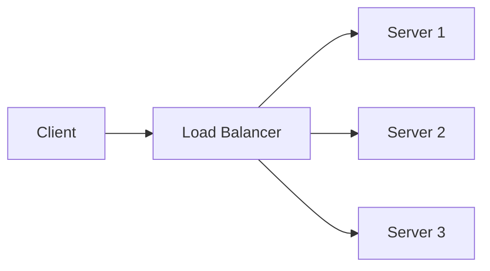

# Load Balancers

A load balancer distributes incoming traffic across multiple servers.

Instead of sending every request to one server, it spreads requests between healthy servers so the system can handle more users and remain available if one server fails.

## Why Use Load Balancers?

- Improve availability.
- Improve scalability.
- Reduce the load on each server.
- Hide server failures from users.
- Route traffic to healthy servers only.
- Support zero-downtime deployments.

## Basic Structure



The client sends a request to the load balancer. The load balancer chooses one backend server and forwards the request.

## Common Load Balancing Algorithms

### Round Robin

Requests are sent to servers one by one in order.

Example:

```text
Request 1 -> Server A
Request 2 -> Server B
Request 3 -> Server C
Request 4 -> Server A
```

Use it when servers have similar capacity and requests have similar cost.

### Least Connections

The load balancer sends the next request to the server with the fewest active connections.

Use it when some requests take longer than others.

### Weighted Round Robin

Servers receive traffic based on assigned weights.

Example:

- Server A has weight `3`.
- Server B has weight `1`.

Server A receives about three times more traffic than Server B.

Use it when servers have different capacities.

### IP Hash

The load balancer chooses a server based on the client's IP address.

This can help send the same client to the same server repeatedly, but it can distribute traffic unevenly if many users come from the same network.

## Layer 4 vs Layer 7 Load Balancing

### Layer 4 Load Balancing

Layer 4 load balancing works at the transport layer.

It routes traffic using information such as:

- IP address.
- TCP port.
- UDP port.

It is fast because it does not inspect the full HTTP request.

Example:

- Forward TCP traffic from port `443` to one of several backend servers.

### Layer 7 Load Balancing

Layer 7 load balancing works at the application layer.

It can route traffic using HTTP information such as:

- URL path.
- Headers.
- Cookies.
- Hostname.
- Request method.

Example:

```text
/api/users  -> User Service
/api/orders -> Order Service
/images     -> Static File Service
```

Layer 7 load balancing is more flexible, but usually has more overhead than Layer 4.

## Health Checks

A load balancer should not send traffic to unhealthy servers.

Health checks are small requests used to verify that a server is working.

Example:

```text
GET /health
```

If a server fails health checks, the load balancer removes it from rotation. When the server becomes healthy again, it can be added back.

## Sticky Sessions

Sticky sessions send the same client to the same backend server.

This can be useful when session data is stored in server memory.

However, sticky sessions can make scaling harder because traffic may become uneven. A better approach is often to store session data in a shared store such as Redis or a database.

## Active-Passive and Active-Active

### Active-Passive

One load balancer handles traffic, and another waits as a backup.

If the active load balancer fails, the passive one takes over.

### Active-Active

Multiple load balancers handle traffic at the same time.

This improves capacity and availability, but it requires more coordination.

## Example in System Design

Suppose an online store has three application servers.

Without a load balancer:

```text
Users -> Server A
```

If Server A fails, the whole application may become unavailable.

With a load balancer:

```text
Users -> Load Balancer -> Server A
                     -> Server B
                     -> Server C
```

If Server A fails, the load balancer can send traffic to Server B and Server C.

## Benefits

- Better fault tolerance.
- Easier horizontal scaling.
- Better traffic distribution.
- Easier maintenance and deployments.

## Limitations

- The load balancer can become a bottleneck.
- The load balancer can become a single point of failure if there is no backup.
- Sticky sessions can create uneven traffic.
- Layer 7 routing adds more processing overhead.

## Summary

Load balancers are important in system design because they distribute traffic, improve availability, and help systems scale horizontally. A good design usually combines load balancing with health checks, redundancy, and stateless backend servers.
