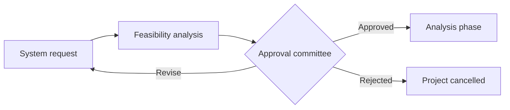

# Feasibility Analysis

Feasibility analysis is the reality check of the planning phase. The system request says what the business wants; feasibility analysis asks whether it can actually be built, afforded, and absorbed by the organisation. Its output is a feasibility study that either backs the project for approval or kills it early, when killing it is still cheap.

It is not a one-off gate. The analysis is written during planning, then revisited whenever the scope, budget, or technology assumptions change, because the risks it lists are the same risks that later derail delivery.

## The Three Feasibilities

### 1. Technical Feasibility

Can we build it? This is a risk assessment, not a yes/no answer. The risk goes up with unfamiliarity and size:

- **Familiarity with the application domain.** A team that does not understand the business area will misread requirements and miss the obvious edge cases.
- **Familiarity with the technology.** New languages, frameworks, databases, or platforms extend timelines and hide surprises until integration.
- **Project size.** More people, more teams, more features, and longer schedules all raise coordination risk.
- **Compatibility.** New systems rarely live alone. Integrating with existing systems, data formats, and vendor products is often the hardest part of the build.

### 2. Economic Feasibility

Should we build it? Also called a cost-benefit analysis. The steps:

1. **Identify costs and benefits**, both development (one-off) and operational (recurring).
2. **Assign values** to each, in money, working with the people closest to the numbers.
3. **Determine cash flow** across the years the system is expected to run.
4. **Compute the returns** using standard financial measures.

| Category | Examples |
| --- | --- |
| Development costs | Salaries, hardware, licences, consultants, training, office space |
| Operational costs | Hosting, support staff, maintenance, licence renewals |
| Tangible benefits | Increased sales, reduced staff cost, lower inventory, fewer errors |
| Intangible benefits | Better customer service, stronger brand, better decision-making |

Intangible benefits are real but resist a number. Estimate them where you can, list them explicitly where you cannot, and never quietly drop them because they are inconvenient to price.

Three measures are usually reported together, because each hides something on its own:

- **Return on investment (ROI)**: $\mathrm{ROI} = \dfrac{\text{Total benefits} - \text{Total costs}}{\text{Total costs}}$. Ignores when the money arrives.
- **Break-even point**: the year cumulative benefits overtake cumulative costs. Ignores everything after that year.
- **Net present value (NPV)**: $\mathrm{NPV} = \sum_{t=1}^{n} \dfrac{B_t - C_t}{(1+r)^t}$, discounting future cash flows at rate $r$. A negative NPV means the money is better spent elsewhere.

All three are computed on one project in the [NPV Worked Example](NPV%20Worked%20Example.md).

### 3. Organisational Feasibility

Will people use it? A technically sound, cheap system that nobody adopts is a failed system. Two questions:

- **Strategic alignment.** How well does the system fit the business objectives it claims to serve? The weaker the fit, the more likely it gets defunded when priorities shift.
- **Stakeholder analysis.** Who is affected, and how do they feel about it?
    - The **project champion**, a senior sponsor who promotes the project and pays for it.
    - **Organisational management**, whose visible support signals the project matters.
    - **System users**, who decide adoption in practice and whose involvement early on is the strongest predictor of it.

Resistance is a finding, not a failure of the analysis. Record it, because the mitigation plan (training, phased rollout, redesigned workflows) belongs in the project plan.

## Common Pitfalls

- Treating the study as paperwork for approval rather than a risk register to act on.
- Optimistic estimates from the team that wants the project funded, with no independent review.
- Counting only tangible benefits, so every quality or service improvement scores zero.
- Ignoring operational costs, which typically outlive development costs by years.
- Never revisiting the analysis after the assumptions it rests on have changed.

<quiz>
A team proposes replacing an in-house reporting tool with a system built on a database engine nobody on the team has used, integrating with two vendor products. Which feasibility is most at risk?

- [x] Technical, because unfamiliar technology plus integration with existing systems are two of the largest risk drivers
> Correct. Familiarity and compatibility are exactly what technical feasibility assesses, and both are weak here.
- [ ] Economic, because new technology is always more expensive
> Cost may rise, but the described weakness is capability and integration, not the cost-benefit balance.
- [ ] Organisational, because users dislike new tools
> Nothing in the scenario says the users resist it, or that it misaligns with business objectives.
- [ ] None, because feasibility only applies to new systems rather than replacements
> Replacements carry the same risks, often more, since they must match behaviour the old system already has.
</quiz>

<quiz>
A proposed system has a strong positive NPV and low technical risk, but the department heads who would use it were not consulted and resent losing control of their own spreadsheets. What should the feasibility study conclude?

- [ ] Proceed, since two of three feasibilities are strong
> Organisational feasibility is not outvoted by the other two. A system nobody adopts returns none of the modelled benefits.
- [x] Flag organisational feasibility as the binding risk and require user involvement and a mitigation plan before approval
> Correct. Resistance is a finding to act on, and user involvement early is the strongest predictor of adoption.
- [ ] Reduce the projected benefits until the NPV reflects the resistance
> Quietly discounting the numbers hides the real problem instead of naming it and planning around it.
- [ ] Defer the question to the implementation phase
> By implementation the workflows and rollout plan are already fixed, which is far too late to redesign around resistance.
</quiz>
