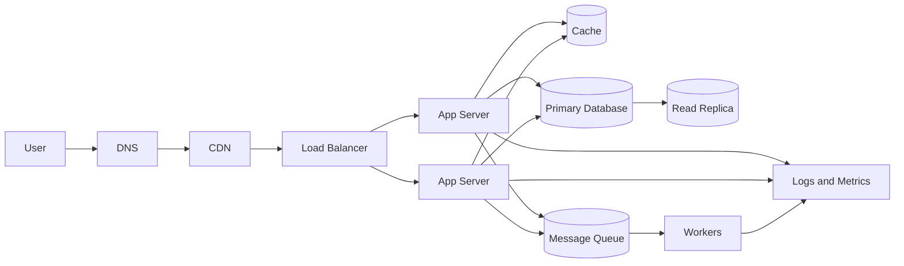

# System Design

System design is the practice of turning product requirements into a technical structure that can handle real users, real data, failures, growth, and change.

At small scale, a system may be only one application server and one database. As the workload grows, the design is expanded incrementally: add DNS, split clients from servers, choose data storage, scale compute, balance traffic, replicate data, cache hot reads, serve global users, move slow work to queues, and observe the system in production.

## The Incremental View

The easiest way to learn system design is to grow one simple system step by step.

Each step solves one pressure:

| Pressure | Common design move |
| --- | --- |
| Users need a stable name | Add DNS |
| Data must survive restarts | Add a database |
| One machine is too small | Scale vertically or horizontally |
| One server cannot handle all traffic | Add a load balancer |
| Reads overload the database | Add replicas or caches |
| Users are far from the server | Add a CDN, regions, or GeoDNS |
| Slow tasks block requests | Add queues and workers |
| Failures are hard to see | Add logs, metrics, alerts, and automation |

## A Typical Web System

This diagram is not a required template. It is a vocabulary. In an interview, design review, or real project, you start with requirements and add only the pieces that solve a real problem.

## How to Approach a Design

1. Clarify the goal, users, and main features.
2. Estimate scale: users, requests, data size, read/write ratio, and latency needs.
3. Sketch the simplest working design.
4. Find bottlenecks and failure points.
5. Add components incrementally, explaining the trade-off each one introduces.
6. Discuss data model, APIs, consistency, reliability, security, and observability.

Good system design is not about naming every infrastructure product. It is about explaining why each part exists and what problem it solves.

## Core Topics

- [Client, Server, and DNS](Client,%20Server,%20and%20DNS.md)
- [Databases in System Design](Databases%20in%20System%20Design.md)
- [Data Modeling and RDBMS](Data%20Modeling/index.md)
- [Scaling](Scaling.md)
- [Load Balancers](Load%20Balancers.md)
- [Database Replication](Database%20Replication.md)
- [Caching](Caching.md)
- [CDN and GeoDNS](CDN%20and%20GeoDNS.md)
- [Stateful vs Stateless Architecture](Stateful%20vs%20Stateless%20Architecture.md)
- [Message Queues](Message%20Queues.md)
- [Observability and Automation](Observability%20and%20Automation.md)
- [API Gateways](API%20Gateways.md)
- [Object Storage](Object%20Storage.md)

## Check Your Understanding

<quiz>
Why is system design often taught incrementally?

- [x] Because each added component should solve a specific bottleneck, failure mode, or growth problem
> Correct. Incremental design keeps the architecture tied to real pressures instead of turning it into a pile of technologies.
- [ ] Because every production system must use every component in the same order
- [ ] Because databases can only be added after load balancers
- [ ] Because diagrams are more important than requirements
</quiz>
